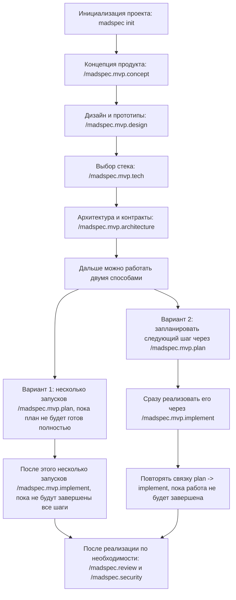
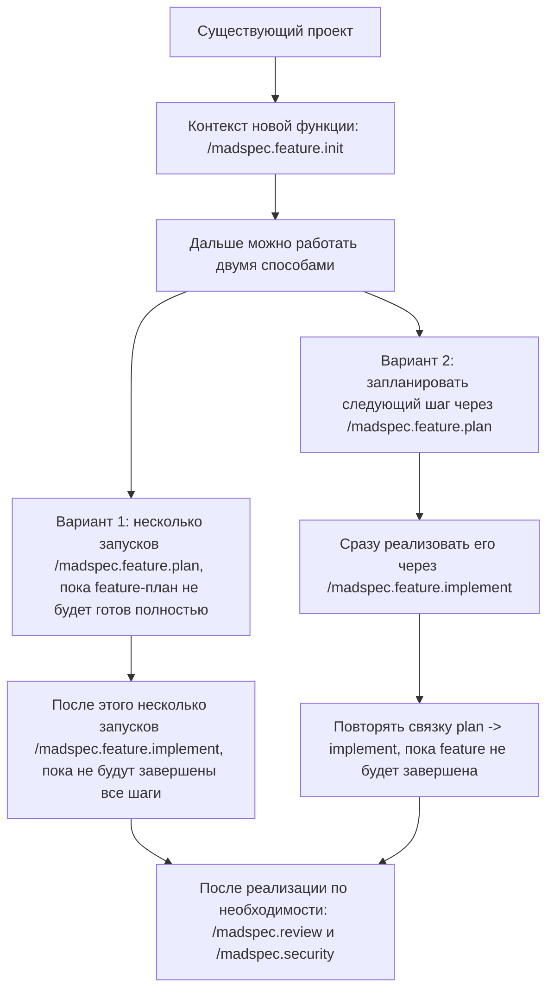

# MADSpec

MADSpec - это фреймворк для разработки программного обеспечения с помощью LLM-агентов. Он дает команде понятную структуру проекта, процесс работы с учетом веток и слой структурированной памяти, чтобы контекст и принятые решения не терялись между сессиями.

## Кому Подходит

- Командам, которые хотят работать с AI-агентами более предсказуемо
- Проектам, где важно сохранять прозрачность архитектурных решений и прогресса реализации
- Пользователям Cursor, GitHub Copilot, opencode, Roo Code, Kilo Code и SourceCraft, которым нужен единый процесс работы

## Что Дает MADSpec

- MVP-процесс для разработки продукта с нуля: от концепции до реализации
- Feature-процесс для добавления функциональности в существующий код
- Отдельные артефакты по веткам в `.madspec/<branch>/` вместо одного общего состояния проекта
- Структурированную память в `.madspec/<branch>/memory/` и автоматически собираемые Markdown-файлы поверх нее
- Процессы review и security для проверки качества после реализации
- Подготовленную структуру команд и файлов для поддерживаемых AI-сред

## Установка

### Требования

- Python 3.11+
- [uv](https://docs.astral.sh/uv/)
- Git
- Один из поддерживаемых AI-агентов

### Постоянная Установка

```bash
uv tool install madspec-cli --from git+https://github.com/MADTeacher/MADSpec.git
```

Базовое использование:

```bash
madspec init <PROJECT_NAME> --ai cursor-agent
madspec init .
madspec check
```

Если использовать `madspec init .` без `--ai`, MADSpec инициализирует проект в текущей директории и предложит вручную выбрать AI-среду во время запуска.

Обновление:

```bash
uv tool install madspec-cli --force --from git+https://github.com/MADTeacher/MADSpec.git
```

### Одноразовый Запуск

```bash
uvx --from git+https://github.com/MADTeacher/MADSpec.git madspec init <PROJECT_NAME>
```

## Поддерживаемые AI-Агенты

| Агент | Тип | Директория | Нужен CLI |
| --- | --- | --- | --- |
| [Cursor](https://cursor.sh/) | IDE | `.cursor/commands/` | Нет |
| [opencode](https://opencode.ai/) | CLI | `.opencode/command/` | Да |
| [Kilo Code](https://github.com/Kilo-Org/kilocode) | IDE | `.kilocode/rules/` | Нет |
| [Roo Code](https://roocode.com/) | IDE | `.roo/rules/` | Нет |
| [SourceCraft](https://sourcecraft.dev/) | IDE | `.codeassistant/commands/` | Нет |
| [GitHub Copilot](https://github.com/features/copilot) | IDE | `.github/agents/` | Нет |

## Как Работать С MADSpec

### MVP-Процесс

Используйте команды `madspec.mvp.*`, когда создаете продукт с нуля:

Ниже показан типовой порядок работы. После базовых стадий можно либо сначала полностью закончить планирование, либо идти итерациями: планирование -> реализация -> планирование -> реализация.



Кратко по этапам:

- `madspec init <PROJECT_NAME> --ai <agent>` - создает проект, структуру `.madspec` и команды для выбранной AI-среды
- `/madspec.mvp.concept` - фиксирует идею проекта, целевую аудиторию, сценарии и ключевые функции
- `/madspec.mvp.design` - описывает пользовательский опыт, экраны и прототипы интерфейса
- `/madspec.mvp.tech` - помогает выбрать стек технологий и зафиксировать технические решения
- `/madspec.mvp.architecture` - формализует структуру проекта, модель данных и контракты
- `/madspec.mvp.plan` - добавляет и уточняет шаги реализации
- `/madspec.mvp.implement` - выполняет запланированные шаги реализации
- `/madspec.review` и `/madspec.security` - используются после реализации для проверки качества и рисков

```bash
madspec init <PROJECT_NAME> --ai <agent>
/madspec.mvp.concept "Идея проекта"
/madspec.mvp.design
/madspec.mvp.tech
/madspec.mvp.architecture
/madspec.mvp.plan
/madspec.mvp.implement
```

Подробности по каждой стадии есть в [документации MVP-процесса](docs/mvp/README.md).

### Feature-Процесс

Используйте команды `madspec.feature.*`, когда добавляете функциональность в существующий проект:

Ниже показан типовой путь для работы в уже существующем проекте. После `feature.init` можно либо сначала собрать весь план, либо идти короткими итерациями `plan -> implement`.



Кратко по этапам:

- `/madspec.feature.init` - описывает новую функцию и собирает контекст существующего проекта
- `/madspec.feature.plan` - формирует или уточняет шаги реализации для этой функции
- `/madspec.feature.implement` - реализует подготовленные шаги в существующем коде
- `/madspec.review` и `/madspec.security` - используются после реализации для проверки качества и рисков


```bash
/madspec.feature.init "Описание новой функции"
/madspec.feature.plan
/madspec.feature.implement
```

Подробности по этому сценарию есть в [документации Feature-процесса](docs/feature/README.md).

### Общие Команды

Эти команды можно запускать после заметных изменений в любом режиме:

```bash
/madspec.review
/madspec.security
```

## Структурированная Память

MADSpec хранит основное состояние проекта в `.madspec/<branch>/memory/`. Файлы вроде `concept.md`, `tech-stack.md`, `architecture.md` и `implementation-plan.md` собираются из этого состояния автоматически и не являются основным источником истины.

Такой подход упрощает возобновление длинной работы и отделяет контекст разных веток друг от друга.

## Дополнительно

### Навыки Агента

Во время инициализации MADSpec также копирует навыки агента в целевую среду, включая:

- `generate-agents-md`
- `madspec-cli-operator`

### Субагенты

Субагенты не поставляются вместе с MADSpec. MADSpec CLI создает структуру проекта и команды, но сами субагенты нужно устанавливать и настраивать отдельно в целевой AI-среде.

## Документация

- [Быстрый старт](QUICKSTART.md)
- [Общая документация по процессу работы](docs/README.md)
- [CLI-документация](docs/cli/README.md)
- [MVP-процесс](docs/mvp/README.md)
- [Feature-процесс](docs/feature/README.md)
- [Процессы review и security](docs/other/README.md)

## Поддержка

Если у вас есть вопросы или идеи по улучшению фреймворка, создайте issue в репозитории.
