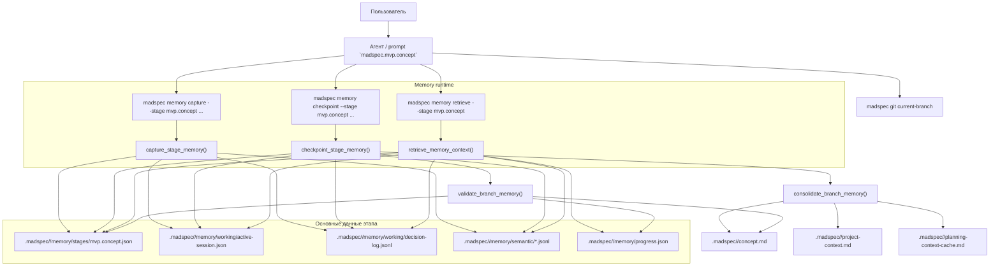
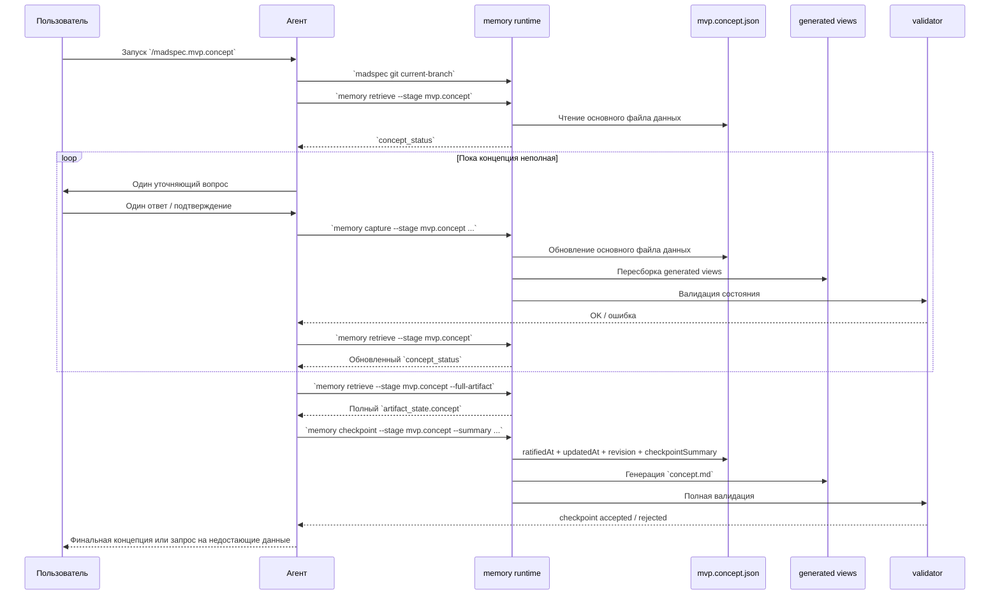
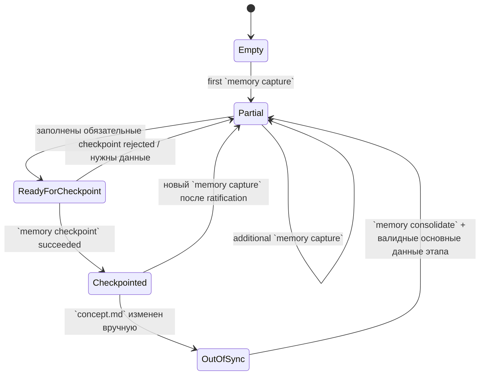

# MVP Concept

Актуальная документация по тому, как сейчас работает `madspec.mvp.concept` в MADSpec после перехода на memory-first pipeline.

## Что это за этап

`madspec.mvp.concept` определяет:

- что за система разрабатывается в общем виде
- для кого она делается
- какую проблему решает
- какие функции являются основными и как они приоритизированы

На этом этапе запрещено опираться на "живой" контекст чата как на основной источник данных. Реальные данные этапа хранятся в structured memory, а итоговый `concept.md` собирается автоматически из этих данных.

## Где хранятся реальные данные

Для `mvp.concept` реальные данные этапа хранятся здесь:

- `.madspec/<BRANCH>/memory/stages/mvp.concept.json`

Автоматически собираемые файлы:

- `.madspec/<BRANCH>/concept.md`
- `.madspec/<BRANCH>/project-context.md`
- `.madspec/<BRANCH>/planning-context-cache.md`

Это означает:

- `concept.md` нельзя считать основным файлом хранения данных
- ручное редактирование `concept.md` считается рассинхроном
- агент обязан работать от structured memory, а не собирать документ "по памяти"
- по умолчанию агент должен читать краткий `concept_status`, а полный `artifact_state.concept` запрашивать только в конце этапа

## Алгоритм работы

### 1. Инициализация контекста

Агент:

1. Определяет текущую ветку через `madspec git current-branch`
2. Вызывает `madspec memory retrieve --stage mvp.concept --json-output`
3. Смотрит в `concept_status`, какие обязательные поля уже заполнены, а каких не хватает

### 2. Диалог и инкрементальное накопление данных

Агент задает вопросы строго по одному и после каждого подтвержденного смыслового блока вызывает:

```bash
madspec memory capture --stage mvp.concept ...
```

Через `memory capture` он обновляет основной файл данных этапа:

- `--project-name`
- `--system-overview`
- `--audience`
- `--scenario`
- `--pain`
- `--feature-p1`, `--feature-p2`, `--feature-p3`
- `--constraint`
- `--assumption`
- `--next-action`

После каждого capture runtime:

1. обновляет `mvp.concept.json`
2. пишет semantic/stage records в JSONL memory
3. пересобирает generated views
4. валидирует согласованность состояния

### 3. Повторное чтение краткого и полного состояния

Перед любым промежуточным или финальным выводом агент снова вызывает:

```bash
madspec memory retrieve --stage mvp.concept --json-output
```

В обычных ходах он работает с кратким контекстом:

- `concept_status.is_complete`
- `concept_status.missing_required_fields`
- `concept_status.filled_fields`
- `concept_status.counts`

Полный `artifact_state.concept` запрашивается только перед финальной валидацией, итоговым обзором и `checkpoint`:

```bash
madspec memory retrieve --stage mvp.concept --json-output --full-artifact
```

Если для разбора проблемного диалога нужна история событий и decision log, добавляй `--include-history`.

Если поля нет в основном файле данных:

- агент не должен додумывать значение сам
- агент обязан задать следующий уточняющий вопрос

### 4. Финальный checkpoint

Когда концепция собрана, агент завершает этап:

```bash
madspec memory checkpoint \
  --stage mvp.concept \
  --summary "<краткий итог>" \
  --evidence .madspec/<BRANCH>/concept.md
```

Checkpoint:

1. проверяет completeness concept state
2. фиксирует `checkpointSummary`
3. обновляет `ratifiedAt`, `updatedAt`, `revision`
4. пересобирает `concept.md` и другие generated views
5. валидирует итоговое состояние

## Какие данные хранит `mvp.concept.json`

`mvp.concept.json` хранит:

- `projectName`
- `systemOverview`
- `createdAt`
- `ratifiedAt`
- `updatedAt`
- `revision`
- `audiences[]`
- `scenarios[]`
- `painPoints[]`
- `features.p1[]`, `features.p2[]`, `features.p3[]`
- `constraints[]`
- `assumptions[]`
- `nextActions[]`
- `checkpointSummary`

## Обязательные поля для успешного checkpoint

Checkpoint `mvp.concept` не пройдет, если отсутствует хотя бы одно из следующих полей:

- `systemOverview`
- минимум один `audience`
- минимум один `scenario`
- минимум один `painPoint`
- минимум одна `P1 feature`

## Структурная схема



## Временная диаграмма



## Диаграмма состояний lifecycle



## На что нужно обращать особое внимание

### 1. `concept.md` не является основным файлом данных

Самая важная вещь в текущей архитектуре:

- нельзя строить логику этапа вокруг содержимого `concept.md`
- нельзя писать `concept.md` вручную
- нельзя считать, что chat context равен реальным данным этапа

Правильный путь только один:

`retrieve -> capture -> retrieve -> checkpoint`

### 2. Агент должен читать перед ответом

Если агент:

- не делает `memory retrieve`
- не смотрит хотя бы в `concept_status`
- не запрашивает полный `artifact_state.concept` перед финальной проверкой
- отвечает "по памяти"

то он снова создает второй, неосновной слой контекста.

### 3. Checkpoint не должен проходить на пустой структуре

Checkpoint валиден только тогда, когда concept state достаточно заполнен.

Если checkpoint проходит при отсутствии:

- общего описания системы
- аудитории
- сценария
- боли
- хотя бы одной P1-функции

это уже дефект pipeline.

### 4. Ручное редактирование `concept.md` должно ловиться

Если кто-то вручную меняет generated `concept.md`, `validate_branch_memory()` обязан это поймать как рассинхрон.

### 5. `systemOverview` обязателен

Отдельный раздел общего описания системы нужен для того, чтобы концепция отвечала не только на вопросы:

- для кого делаем
- какую боль решаем
- какие функции нужны

но и на базовый вопрос:

- что это вообще за система в целом

Без этого итоговый `concept.md` получается функциональным, но не дает нормального общего контекста.

## Ключевые команды

Пример корректного цикла:

```bash
madspec memory retrieve --stage mvp.concept --json-output

madspec memory capture \
  --stage mvp.concept \
  --project-name "Telegram Posting System" \
  --system-overview "Система помогает создавать, планировать и публиковать Telegram-посты из единого интерфейса." \
  --audience "Один владелец системы, который самостоятельно готовит и публикует контент" \
  --scenario "Создание, предпросмотр, планирование и публикация постов в Telegram" \
  --pain "Слишком много ручной и разрозненной работы при подготовке и публикации постов" \
  --feature-p1 "Создание поста в CRM::Пользователь создает пост внутри системы без внешних источников" \
  --next-action "Proceed to mvp.design"

madspec memory retrieve \
  --stage mvp.concept \
  --json-output \
  --full-artifact

madspec memory checkpoint \
  --stage mvp.concept \
  --summary "Concept validated for Telegram Posting System" \
  --evidence .madspec/<BRANCH>/concept.md
```
