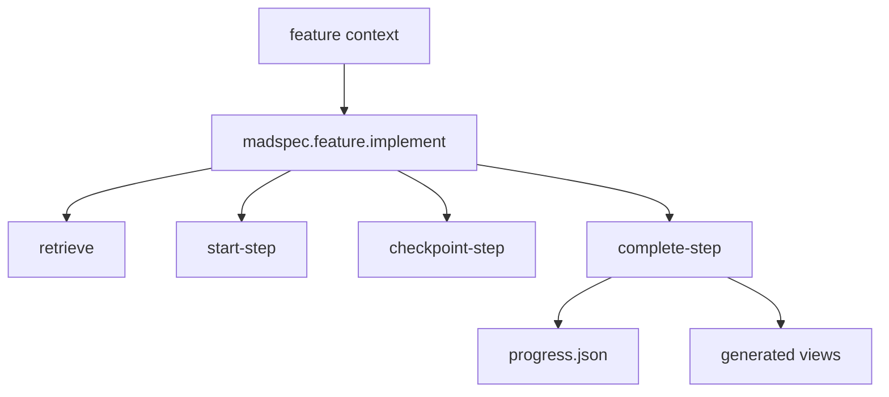
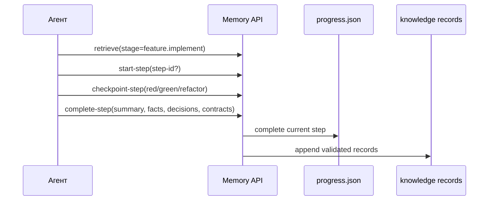
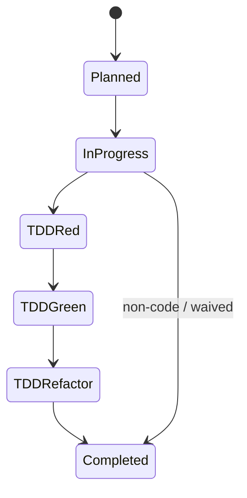
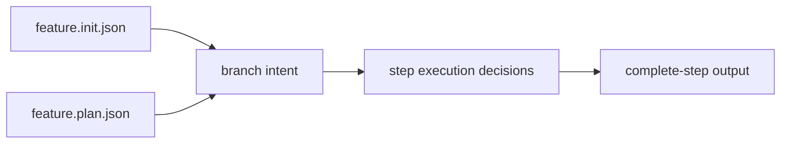

# `madspec.feature.implement`

## Назначение команды

`madspec.feature.implement` выполняет шаги feature-ветки через тот же step runtime API, что и MVP, но с feature-specific branch intent и опорой на `feature.init` context.

## Когда запускать

- после `feature.plan`
- для выполнения следующего executable step
- при возобновлении work-in-progress по feature

## Preconditions / required context

- шаги уже запланированы
- существует `progress.json`
- `project-analysis.md` используется только как reference, не как primary source
- перед началом работы агент обязан прочитать и использовать skill `madspec-cli-operator`

## Источник истины

### Canonical runtime state

- `.madspec/<BRANCH>/memory/progress.json`
- `.madspec/<BRANCH>/memory/working/active-session.json`

### Step-level knowledge

- `events.jsonl`
- `facts.jsonl`
- `decisions.jsonl`
- `contracts.jsonl`

### Generated views

- `.madspec/<BRANCH>/implementation-plan.md`
- `.madspec/<BRANCH>/steps/<step-id>/implementation-context.md`
- `.madspec/<BRANCH>/project-context.md`

## Входы команды

- `madspec memory retrieve --stage feature.implement --json-output`
- `madspec memory start-step --stage feature.implement`
- `madspec memory checkpoint-step --stage feature.implement`
- `madspec memory complete-step --stage feature.implement`
- `madspec git commit --message ...`

Из `retrieve` агент обязан читать `policy_context.required`, `policy_context.advisory` и policy validations. При спорном состоянии можно дополнительно выполнить `madspec policy validate --stage feature.implement --step-id <step-id> --json-output`.

## Пошаговый runtime workflow

1. Агент читает implement context и current feature step.
2. Агент сверяет шаг с active policies из `policy_context`.
3. Запускает шаг через `start-step`.
4. Фиксирует TDD cycle через `checkpoint-step`.
5. Завершает шаг через `complete-step`, записывая устойчивые facts/decisions/contracts.
6. Повторно читает `retrieve` и двигается к следующему executable step.

## Canonical data model

Runtime-форма совпадает с MVP implementation:

- `plannedSteps[]`
- `completedSteps[]`
- `currentImplementStep`
- `stepStatus[stepId]`
- `stepMetadata[stepId]`

Ключевое отличие:

- branch intent, coverage и messages должны интерпретироваться через feature context из `feature.init` / `feature.plan`

## Generated artifacts

- `implementation-plan.md`
- `steps/<step-id>/implementation-context.md`
- `project-context.md`

## Диаграммы

## Типовые ошибки / drift / ограничения

- runtime-state редактируется вручную
- `project-analysis.md` воспринимается как canonical source
- step completion не записывает knowledge records

## Соседние команды и handoff

- предыдущая команда: [`madspec.feature.plan`](./madspec.feature.plan.md)
- соседние quality-команды: [`madspec.review`](../other/madspec.review.md), [`madspec.security`](../other/madspec.security.md)

## Что не является источником истины

- `.madspec/<BRANCH>/implementation-plan.md`
- `.madspec/<BRANCH>/project-analysis.md`
- любые шаговые заметки вне memory workflow
