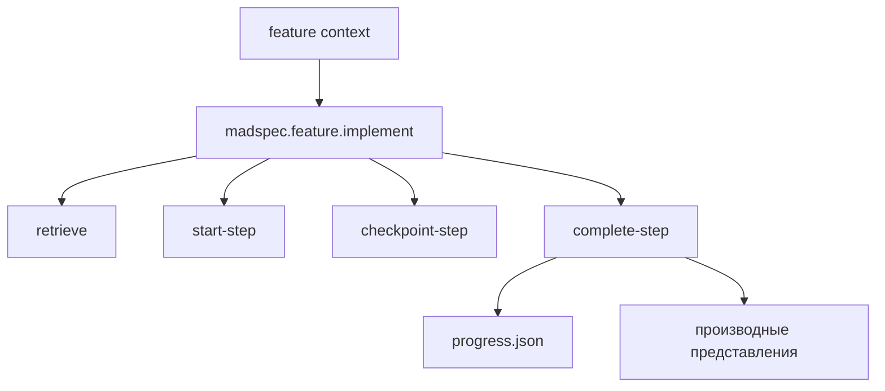
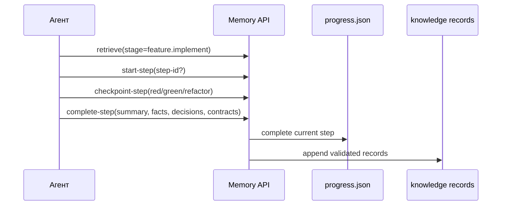
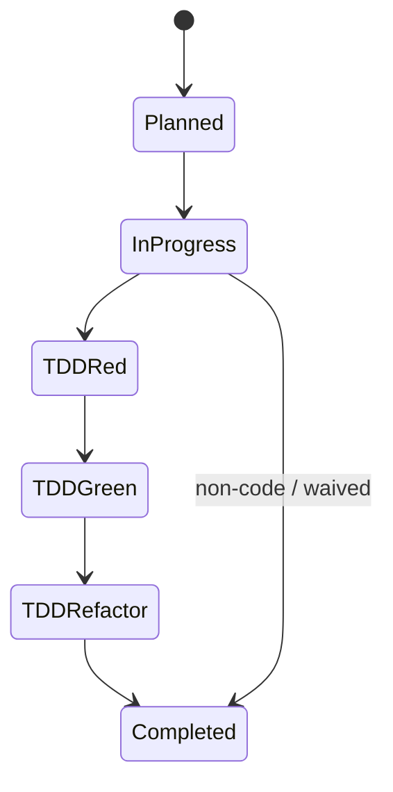
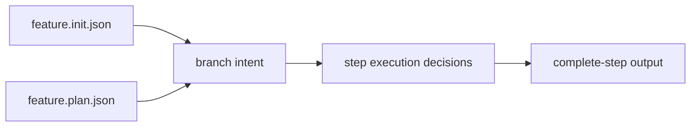

# `madspec.feature.implement`

## Назначение команды

`madspec.feature.implement` выполняет шаги feature-ветки через тот же пошаговый API состояния выполнения, что и MVP, но с намерением ветки, специфичным для feature, и опорой на контекст `feature.init`.

## Когда запускать

- после `feature.plan`
- для выполнения следующего исполнимого шага
- при возобновлении незавершенной работы по feature

## Предварительные условия и обязательный контекст

- шаги уже запланированы
- существует `progress.json`
- `project-analysis.md` используется только как справочный материал, а не как основной источник
- перед началом работы агент обязан прочитать и использовать навык `madspec-cli-operator`

## Источник истины

### Каноническое состояние выполнения

- `.madspec/<BRANCH>/memory/progress.json`
- `.madspec/<BRANCH>/memory/working/active-session.json`

### Знания уровня шага

- `events.jsonl`
- `facts.jsonl`
- `decisions.jsonl`
- `contracts.jsonl`

### Производные представления

- `.madspec/<BRANCH>/implementation-plan.md`
- `.madspec/<BRANCH>/steps/<step-id>/implementation-context.md`
- `.madspec/<BRANCH>/project-context.md`

## Входы команды

- `madspec memory retrieve --stage feature.implement --toon-output`, если этот контекст читает агент
- `madspec memory start-step --stage feature.implement`
- `madspec memory checkpoint-step --stage feature.implement`
- `madspec memory complete-step --stage feature.implement`
- `madspec git commit --message ...`

Из `retrieve` агент обязан читать `policy_context.required`, `policy_context.advisory` и результаты проверки правил. При спорном состоянии можно дополнительно выполнить `madspec policy validate --stage feature.implement --step-id <step-id> --toon-output`, если этот вывод читает агент.

## Пошаговый процесс выполнения

1. Агент читает контекст реализации и текущий шаг feature.
2. Агент сверяет шаг с действующими правилами из `policy_context`.
3. Запускает шаг через `start-step`.
4. Фиксирует TDD cycle через `checkpoint-step`.
5. Завершает шаг через `complete-step`, записывая устойчивые `facts/decisions/contracts`.
6. Повторно читает `retrieve` и двигается к следующему исполнимому шагу.

## Каноническая модель данных

Форма состояния совпадает с MVP-реализацией:

- `plannedSteps[]`
- `completedSteps[]`
- `currentImplementStep`
- `stepStatus[stepId]`
- `stepMetadata[stepId]`

Ключевое отличие:

- намерение ветки, покрытие и сообщения должны интерпретироваться через контекст feature из `feature.init` / `feature.plan`

## Производные артефакты

- `implementation-plan.md`
- `steps/<step-id>/implementation-context.md`
- `project-context.md`

## Диаграммы

## Типовые ошибки, расхождения и ограничения

- состояние выполнения редактируется вручную
- `project-analysis.md` воспринимается как канонический источник
- step completion не записывает knowledge records

## Соседние команды и передача дальше

- предыдущая команда: [`madspec.feature.plan`](./madspec.feature.plan.md)
- соседние quality-команды: [`madspec.review`](../other/madspec.review.md), [`madspec.security`](../other/madspec.security.md)

## Что не является источником истины

- `.madspec/<BRANCH>/implementation-plan.md`
- `.madspec/<BRANCH>/project-analysis.md`
- любые шаговые заметки вне процесса `memory`
