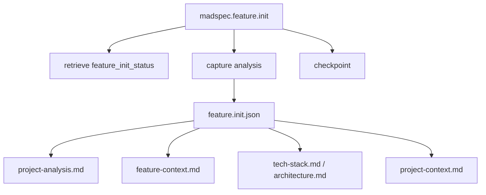
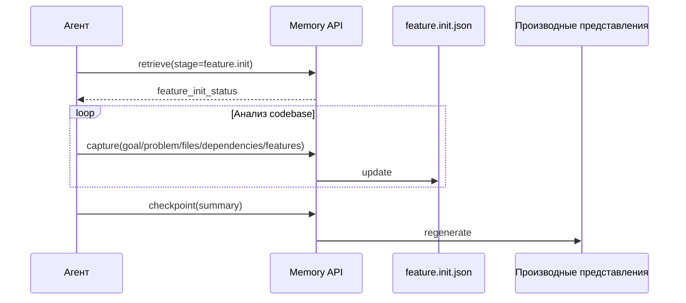
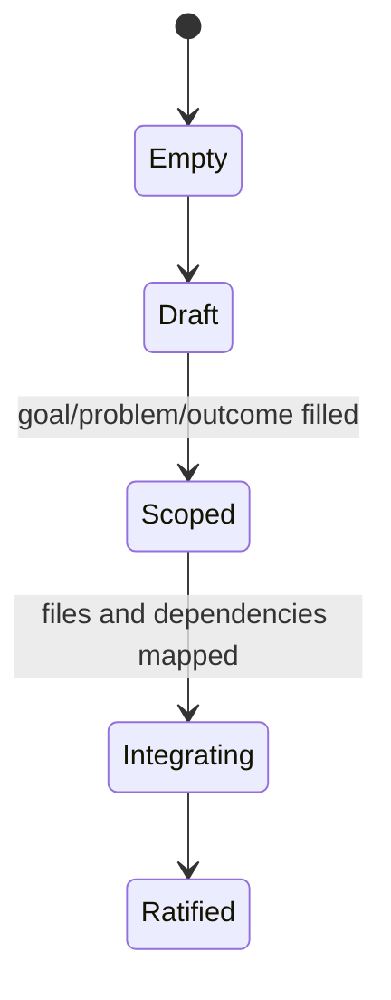
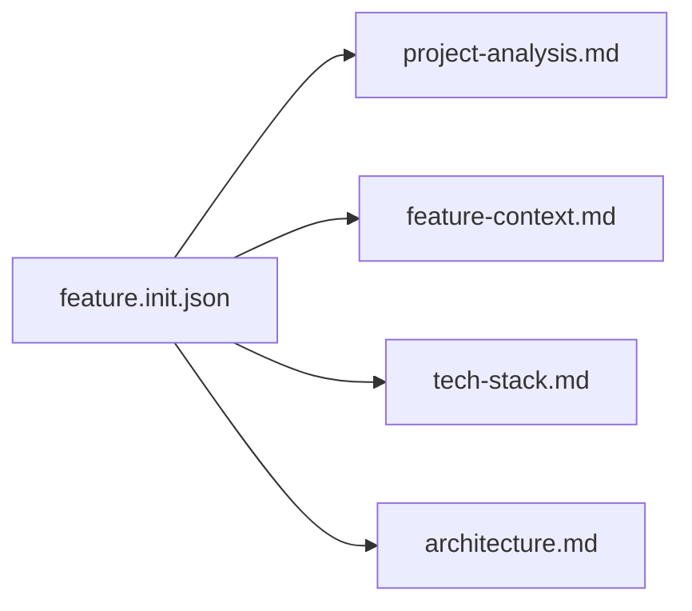

# `madspec.feature.init`

## Назначение команды

`madspec.feature.init` анализирует существующий проект и формализует цель новой функциональности, ее постановку проблемы, ожидаемый результат и точки интеграции в текущей кодовой базе.

## Когда запускать

- при начале работы над новой функциональностью в существующей ветке
- до любого планирования feature
- когда нужно понять, какие файлы, модули и контракты будут затронуты

## Предварительные условия и обязательный контекст

- существует кодовая база для анализа
- доступен контекст ветки
- агент готов фиксировать выводы в `feature.init.json`, а не только в заметках Markdown
- перед началом работы агент обязан прочитать и использовать навык `madspec-cli-operator`

## Источник истины

### Каноническое состояние

- `.madspec/<BRANCH>/memory/stages/feature.init.json`

### Рабочее состояние

- `active-session.json`
- семантические записи стадии
- минимальный рабочий набор ветки: `progress.json`, `decision-log.jsonl`, `events.jsonl`, `semantic/*.jsonl`

### Производные представления

- `.madspec/<BRANCH>/project-analysis.md`
- `.madspec/<BRANCH>/feature-context.md`
- `.madspec/<BRANCH>/tech-stack.md`
- `.madspec/<BRANCH>/architecture.md`
- `.madspec/<BRANCH>/project-context.md`

## Входы команды

- пользовательское описание новой функциональности
- `madspec memory retrieve --stage feature.init --toon-output`, если этот контекст читает агент
- `madspec memory capture --stage feature.init ...`
- `madspec memory checkpoint --stage feature.init --summary ...`

## Пошаговый процесс выполнения

1. Агент получает `feature_init_status`.
2. Анализирует текущий проект, изменяемые файлы, новые файлы, зависимости и риски.
3. Сохраняет результат через `capture`.
4. Повторно читает краткий статус и, при необходимости, `--full-artifact`.
5. `checkpoint` ратифицирует `feature.init.json` и пересобирает только производные артефакты `feature.init` и сводку ветки.

## Каноническая модель данных

Ключевые поля:

- `featureGoal`
- `problem`
- `expectedOutcome`
- `projectAnalysis.projectType`
- `projectAnalysis.framework`
- `projectAnalysis.structureNotes[]`
- `projectAnalysis.existingModules[]`
- `projectAnalysis.modifiedFiles[]`
- `projectAnalysis.newFiles[]`
- `projectAnalysis.interfaceContracts[]`
- `projectAnalysis.dependencies[]`
- `projectAnalysis.risks[]`
- `projectAnalysis.recommendations[]`
- `projectAnalysis.techNotes[]`
- `projectAnalysis.architectureNotes[]`
- `features.p1[]`, `features.p2[]`, `features.p3[]`

Обязательные условия checkpoint:

- `featureGoal`
- `problem`
- `expectedOutcome`
- `projectAnalysis.framework`
- хотя бы одна feature
- есть `modifiedFiles` или `newFiles`

## Производные артефакты

- `project-analysis.md`
- `feature-context.md`
- `tech-stack.md`, собранный из `feature.init`
- `architecture.md`, собранный из `feature.init`
- `project-context.md`

## Материализация с учетом стадии

- `feature.init` создает только минимальный рабочий набор ветки, `feature.init.json` и свои производные представления.
- `concept.md`, `ui-design.md`, `data-model.md`, `contracts/openapi.yaml`, `implementation-plan.md`, `planning-context-cache.md`, `review.md` и `security-audit.md` не должны появляться только из-за `feature.init`.
- Артефакты других стадий материализуются лениво при первом входе в соответствующую стадию или через команды полной пересборки `madspec memory init`, `madspec memory consolidate`, `madspec memory validate`.

## Диаграммы

## Типовые ошибки, расхождения и ограничения

- идентификаторы feature не используются дальше в планировании
- изменяемые файлы обсуждены, но не записаны в `modifiedFiles/newFiles`
- `tech-stack.md` принимается за основной источник истины

## Соседние команды и передача дальше

- предыдущая команда: начало feature-процесса
- следующая команда: [`madspec.feature.plan`](./madspec.feature.plan.md)

## Что не является источником истины

- `.madspec/<BRANCH>/project-analysis.md`
- `.madspec/<BRANCH>/feature-context.md`
- `tech-stack.md` и `architecture.md`
