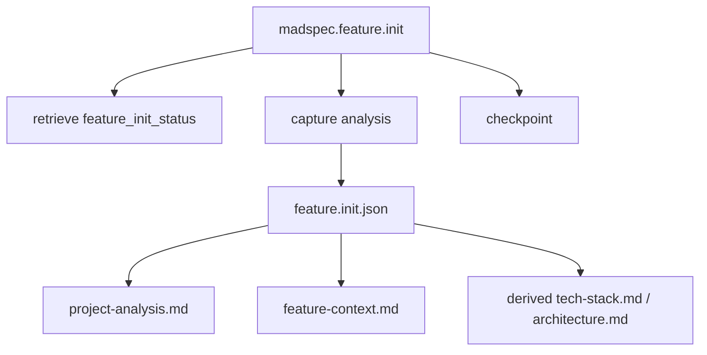
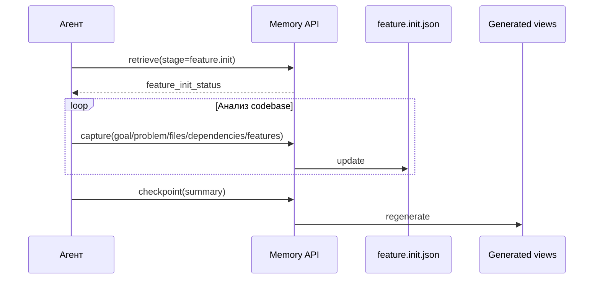
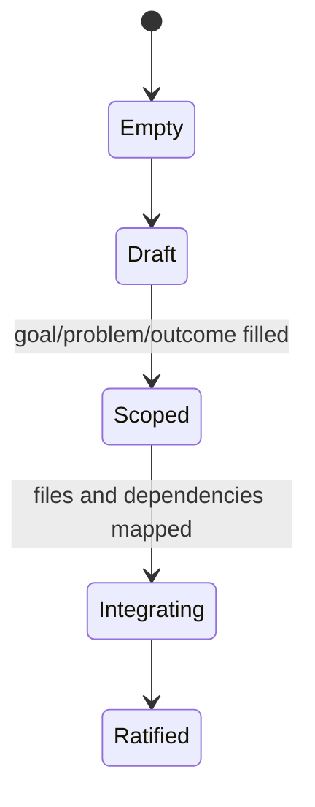
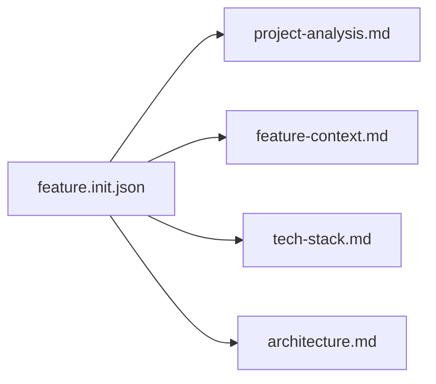

# `madspec.feature.init`

## Назначение команды

`madspec.feature.init` анализирует существующий проект и формализует цель новой функциональности, ее problem statement, expected outcome и точки интеграции в текущем codebase.

## Когда запускать

- при начале работы над новой функциональностью в существующей ветке
- до любого feature planning
- когда нужно понять, какие файлы, модули и контракты будут затронуты

## Preconditions / required context

- существует codebase для анализа
- доступен branch context
- агент готов фиксировать findings в `feature.init.json`, а не только в markdown notes

## Источник истины

### Canonical state

- `.madspec/<BRANCH>/memory/stages/feature.init.json`

### Runtime / working state

- `active-session.json`
- semantic stage records

### Generated views

- `.madspec/<BRANCH>/project-analysis.md`
- `.madspec/<BRANCH>/feature-context.md`
- `.madspec/<BRANCH>/tech-stack.md`
- `.madspec/<BRANCH>/architecture.md`

## Входы команды

- пользовательское описание новой функциональности
- `madspec memory retrieve --stage feature.init --json-output`
- `madspec memory capture --stage feature.init ...`
- `madspec memory checkpoint --stage feature.init --summary ...`

## Пошаговый runtime workflow

1. Агент получает `feature_init_status`.
2. Анализирует текущий проект, модифицируемые файлы, новые файлы, зависимости и risks.
3. Сохраняет результат через `capture`.
4. Повторно читает short status и, при необходимости, `--full-artifact`.
5. `checkpoint` ратифицирует `feature.init.json` и пересобирает derived artifacts.

## Canonical data model

Ключевые поля:

- `featureGoal`
- `problem`
- `expectedOutcome`
- `projectAnalysis.projectType`
- `projectAnalysis.framework`
- `projectAnalysis.structureNotes[]`
- `projectAnalysis.existingModules[]`
- `projectAnalysis.modifiedFiles[]`
- `projectAnalysis.newFiles[]`
- `projectAnalysis.interfaceContracts[]`
- `projectAnalysis.dependencies[]`
- `projectAnalysis.risks[]`
- `projectAnalysis.recommendations[]`
- `projectAnalysis.techNotes[]`
- `projectAnalysis.architectureNotes[]`
- `features.p1[]`, `features.p2[]`, `features.p3[]`

Обязательные условия checkpoint:

- `featureGoal`
- `problem`
- `expectedOutcome`
- `projectAnalysis.framework`
- хотя бы одна feature
- есть `modifiedFiles` или `newFiles`

## Generated artifacts

- `project-analysis.md`
- `feature-context.md`
- feature-derived `tech-stack.md`
- feature-derived `architecture.md`

## Диаграммы

## Типовые ошибки / drift / ограничения

- feature IDs не используются дальше в planning
- изменяемые файлы обсуждены, но не записаны в `modifiedFiles/newFiles`
- derived `tech-stack.md` принимается за canonical source

## Соседние команды и handoff

- предыдущая команда: начало feature workflow
- следующая команда: [`madspec.feature.plan`](./madspec.feature.plan.md)

## Что не является источником истины

- `.madspec/<BRANCH>/project-analysis.md`
- `.madspec/<BRANCH>/feature-context.md`
- derived `tech-stack.md` и `architecture.md`
