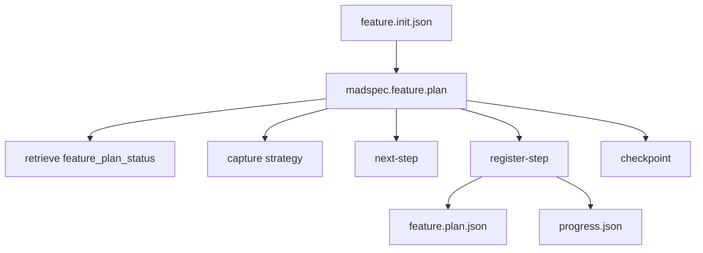
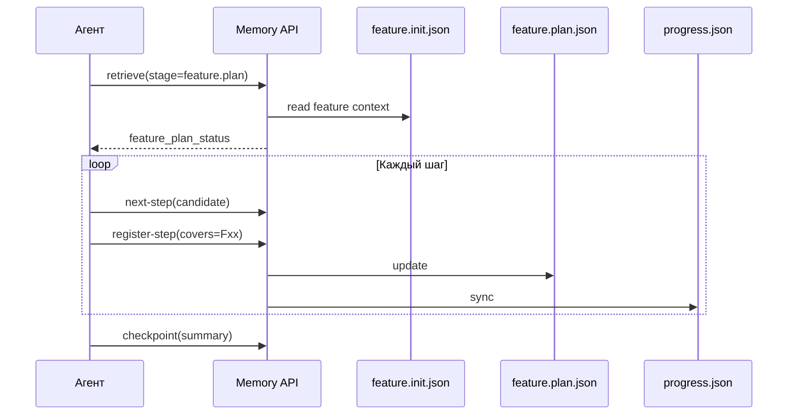
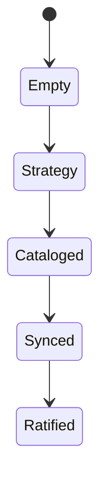
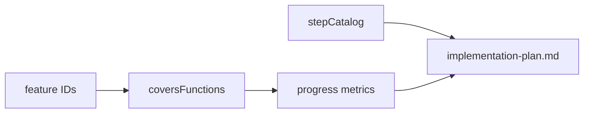

# `madspec.feature.plan`

## Назначение команды

`madspec.feature.plan` строит step catalog для feature-ветки и синхронизирует его с `progress.json`, используя feature IDs и integration analysis из `feature.init`.

## Когда запускать

- после завершения `feature.init`
- при добавлении новых шагов реализации feature
- до начала `feature.implement`

## Preconditions / required context

- существует ratified `feature.init.json`
- planning coverage использует feature IDs из `feature.init`
- generated planning files не редактируются вручную
- перед началом работы агент обязан прочитать и использовать skill `madspec-cli-operator`

## Источник истины

### Canonical state

- `.madspec/<BRANCH>/memory/stages/feature.plan.json`
- `.madspec/<BRANCH>/memory/progress.json`

### Runtime / working state

- `stepMetadata`
- `stepStatus`
- `planningMetadata.stepDependencies`
- `coversFunctions`

### Generated views

- `.madspec/<BRANCH>/implementation-plan.md`
- `.madspec/<BRANCH>/planning-context-cache.md`
- `.madspec/<BRANCH>/steps/<step-id>/planning-context.md`
- `.madspec/<BRANCH>/project-context.md`

## Входы команды

- `madspec memory retrieve --stage feature.plan --json-output`
- `madspec memory capture --stage feature.plan --plan-overview ... --planning-principle ...`
- `madspec memory next-step --stage feature.plan --candidate-step ...`
- `madspec memory register-step --stage feature.plan ...`
- `madspec memory checkpoint --stage feature.plan --summary ...`

## Пошаговый runtime workflow

1. Агент читает `feature.init_status` и `feature_plan_status`.
2. Фиксирует planning strategy для feature.
3. Проверяет candidate step через `next-step`.
4. Регистрирует шаг через `register-step`, связывая `covers` с feature IDs.
5. Runtime обновляет `feature.plan.json`, `progress.json` и generated planning views.
6. `checkpoint` ратифицирует feature plan.

## Canonical data model

`feature.plan.json` использует ту же форму, что и `mvp.plan.json`:

- `planOverview`
- `planningPrinciples[]`
- `stepCatalog[]`
- `nextActions[]`
- `checkpointSummary`

Обязательные условия checkpoint:

- есть `planOverview`
- есть хотя бы один step
- step catalog валиден по `stepKind`, `tddPolicy`, `size`, `complexity`

Reference rules:

- каждый planned step из `progress.json` присутствует в `feature.plan.json`
- у каждого шага есть обязательные step files
- `covers` синхронизирован с feature IDs из `feature.init`

## Generated artifacts

- `implementation-plan.md`
- `planning-context-cache.md`
- `steps/<step-id>/planning-context.md`
- `project-context.md`

## Диаграммы

## Типовые ошибки / drift / ограничения

- `covers` использует свободный текст вместо feature IDs
- шаги есть в `progress.json`, но отсутствуют в `feature.plan.json`
- агент использует generated plan view как primary source

## Соседние команды и handoff

- предыдущая команда: [`madspec.feature.init`](./madspec.feature.init.md)
- следующая команда: [`madspec.feature.implement`](./madspec.feature.implement.md)

## Что не является источником истины

- `.madspec/<BRANCH>/implementation-plan.md`
- `.madspec/<BRANCH>/planning-context-cache.md`
- ручные правки `progress.json`
