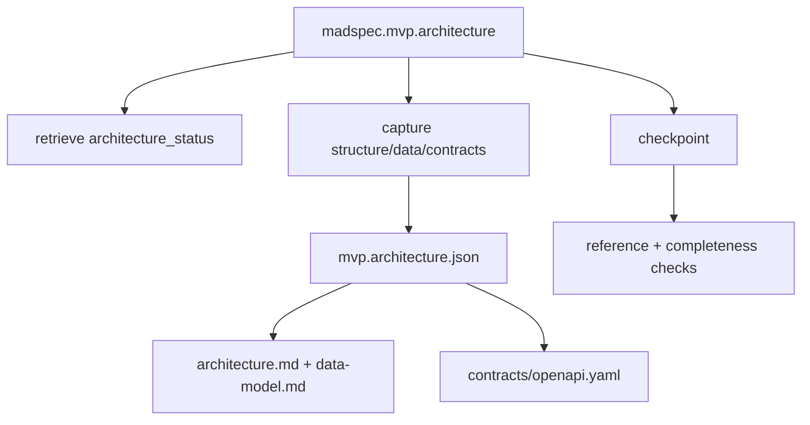
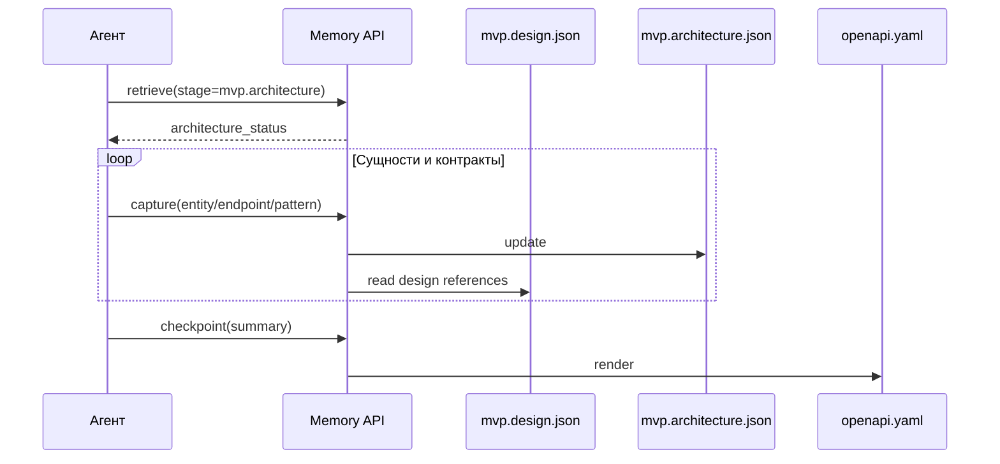
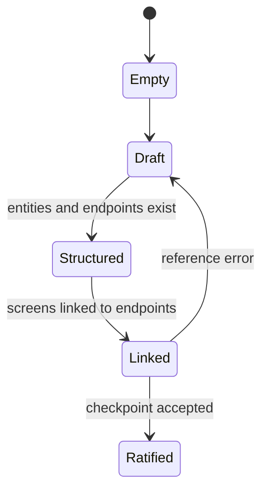
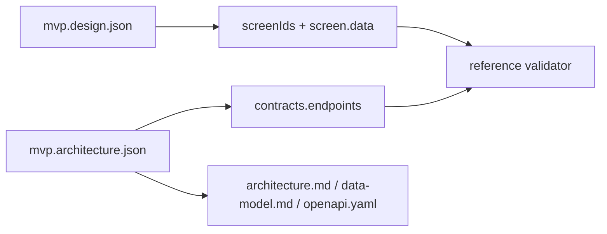

# `madspec.mvp.architecture`

## Назначение команды

`madspec.mvp.architecture` переводит согласованный продуктовый, UI и tech context в структуру проекта, модель данных, API-контракты, интеграции и code principles.

## Когда запускать

- после `mvp.tech`
- когда нужно закрепить data model и contract layer перед планированием шагов
- когда UI уже стабилизирован настолько, чтобы связать screens с endpoints

## Preconditions / required context

- завершены `mvp.concept`, `mvp.design`, `mvp.tech`
- screens и data coverage из design уже известны
- agent не редактирует `architecture.md` или `openapi.yaml` вручную

## Источник истины

### Canonical state

- `.madspec/<BRANCH>/memory/stages/mvp.architecture.json`

### Runtime / working state

- `active-session.json`
- semantic stage records
- `mvp.design.json` используется как reference state для coverage checks

### Generated views

- `.madspec/<BRANCH>/architecture.md`
- `.madspec/<BRANCH>/data-model.md`
- `.madspec/<BRANCH>/contracts/openapi.yaml`
- `.madspec/<BRANCH>/project-context.md`

## Входы команды

- `madspec memory retrieve --stage mvp.architecture --json-output`
- `madspec memory capture --stage mvp.architecture ...`
- `madspec memory checkpoint --stage mvp.architecture --summary ...`

Связанное правило из `mvp.design`: `--screen-data` хранит только логический field id в формате `<screen-id>::<displayed|input>::<name>`. Не записывай туда описания и дополнительные `::` сегменты.

Ключевые flags:

- `--architecture-overview`
- `--project-structure`
- `--directory`
- `--entity`
- `--entity-field`
- `--entity-relationship`
- `--entity-state`
- `--endpoint`
- `--endpoint-screen`
- `--endpoint-field`
- `--endpoint-error`
- `--integration`
- `--code-principle`
- `--pattern`
- `--security-note`
- `--performance-note`
- `--next-action`

## Пошаговый runtime workflow

1. Агент получает `architecture_status`.
2. Инкрементально фиксирует структуру проекта, сущности, связи и endpoints через `capture`.
3. Runtime связывает endpoints с design screens и проверяет поля request/response против `screen.data`.
4. `architecture_completeness_errors()` валидирует overview, directories, entities, endpoints, response fields и наличие code principles/patterns.
5. `checkpoint` пересобирает markdown и OpenAPI artifacts.

## Canonical data model

Ключевые группы полей:

- `architectureOverview`
- `projectStructure.strategy`, `projectStructure.rationale`, `projectStructure.directories[]`
- `dataModel.entities[]`
- `contracts.endpoints[]`
- `integrations[]`
- `codePrinciples[]`
- `patterns[]`
- `securityNotes[]`
- `performanceNotes[]`
- `nextActions[]`

Обязательные условия checkpoint:

- есть `architectureOverview`
- заполнены `projectStructure.strategy` и `rationale`
- есть хотя бы одна directory
- есть хотя бы одна entity с fields
- есть хотя бы один endpoint
- хотя бы один endpoint связан со screen
- есть хотя бы один response field
- есть минимум один `codePrinciple` или `pattern`

## Generated artifacts

- `architecture.md`
- `data-model.md`
- `contracts/openapi.yaml`
- `project-context.md`

## Диаграммы

## Типовые ошибки / drift / ограничения

- endpoint ссылается на неизвестный `screenId`
- design screen не связан ни с одним endpoint
- `screen.data.displayed` не отражен в response fields
- `--project-structure` передан без разделителя `::`; используй формат `<strategy>::<rationale>`, например `feature-first::Keep bot-connection, workspace, and publish-log isolated by capability`
- Для `--endpoint-field` секция `response` допустима как shorthand для `response:200`; для явных кодов ответа используй `response:<status>`
- Не редактируй `.madspec/<BRANCH>/memory/stages/mvp.architecture.json` вручную, даже если validation кажется ложным: исправляй state только через memory CLI
- `architecture.md` и `openapi.yaml` редактируются вручную

## Соседние команды и handoff

- предыдущая команда: [`madspec.mvp.tech`](./madspec.mvp.tech.md)
- следующая команда: [`madspec.mvp.plan`](./madspec.mvp.plan.md)

## Что не является источником истины

- `.madspec/<BRANCH>/architecture.md`
- `.madspec/<BRANCH>/data-model.md`
- `.madspec/<BRANCH>/contracts/openapi.yaml`
