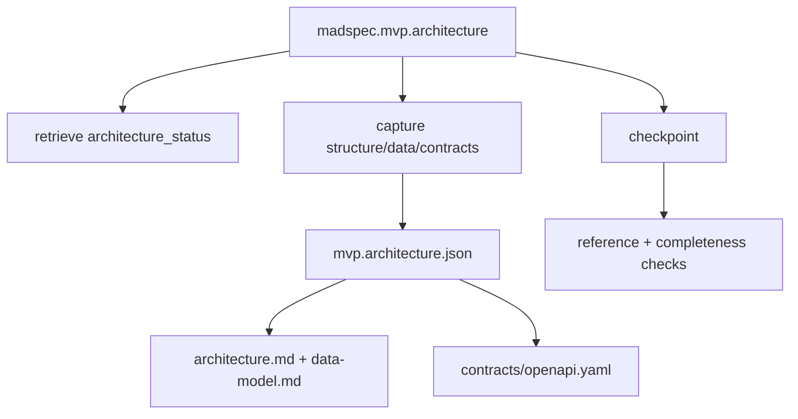
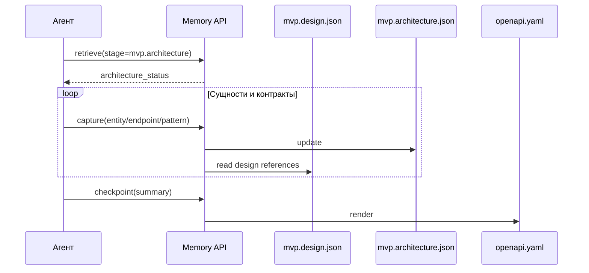
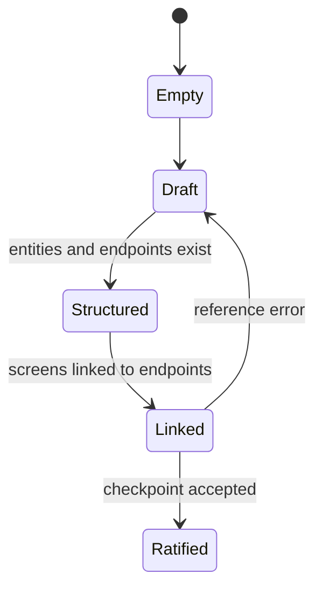
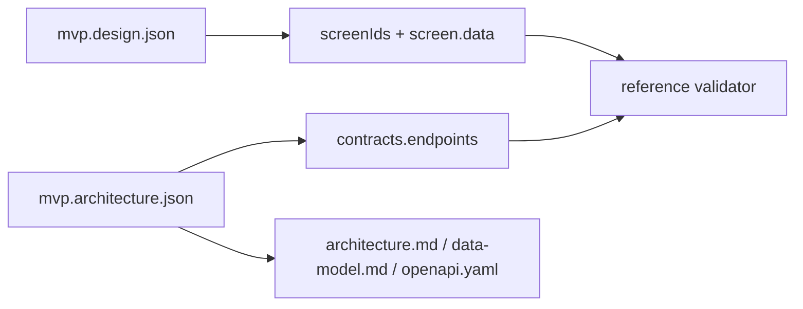

# `madspec.mvp.architecture`

## Назначение команды

`madspec.mvp.architecture` переводит согласованный продуктовый, UI- и технический контекст в структуру проекта, модель данных, API-контракты, интеграции и принципы организации кода.

## Когда запускать

- после `mvp.tech`
- когда нужно закрепить модель данных и слой контрактов перед планированием шагов
- когда UI уже стабилизирован настолько, чтобы связать `screens` с `endpoints`

## Предварительные условия и обязательный контекст

- завершены `mvp.concept`, `mvp.design`, `mvp.tech`
- `screens` и покрытие данных из `design` уже известны
- агент не редактирует `architecture.md` или `openapi.yaml` вручную
- перед началом работы агент обязан прочитать и использовать навык `madspec-cli-operator`

## Источник истины

### Каноническое состояние

- `.madspec/<BRANCH>/memory/stages/mvp.architecture.json`

### Рабочее состояние

- `active-session.json`
- семантические записи стадии
- `mvp.design.json` используется как опорное состояние для проверок покрытия

### Производные представления

- `.madspec/<BRANCH>/architecture.md`
- `.madspec/<BRANCH>/data-model.md`
- `.madspec/<BRANCH>/contracts/openapi.yaml`
- `.madspec/<BRANCH>/project-context.md`

## Входы команды

- `madspec memory retrieve --stage mvp.architecture --toon-output`, если этот контекст читает агент
- `madspec memory capture --stage mvp.architecture ...`
- `madspec memory checkpoint --stage mvp.architecture --summary ...`
- если нужно удалить накопившиеся дубли или заменить канонический снимок стадии целиком, используй `madspec memory snapshots prune --stage mvp.architecture --from-file .madspec/.tmp/<file>.json` или `madspec memory snapshots replace ...`

Связанное правило из `mvp.design`: `--screen-data` хранит только логический field id в формате `<screen-id>::<displayed|input>::<name>`. Не записывай туда описания и дополнительные `::` сегменты.

Ключевые флаги:

- `--architecture-overview`
- `--project-structure`
- `--directory`
- `--entity`
- `--entity-field`
- `--entity-relationship`
- `--entity-state`
- `--endpoint`
- `--endpoint-screen`
- `--endpoint-field`
- `--endpoint-error`
- `--integration`
- `--code-principle`
- `--pattern`
- `--security-note`
- `--performance-note`
- `--next-action`

## Пошаговый процесс выполнения

1. Агент получает `architecture_status`.
2. Инкрементально фиксирует структуру проекта, сущности, связи и endpoints через `capture`.
3. Система связывает `endpoints` с экранами из `design` и проверяет поля `request/response` против `screen.data`.
4. `architecture_completeness_errors()` проверяет обзор, директории, сущности, `endpoints`, поля ответа и наличие принципов или шаблонов кода.
5. `checkpoint` пересобирает Markdown-представления и артефакты OpenAPI.

## Каноническая модель данных

Ключевые группы полей:

- `architectureOverview`
- `projectStructure.strategy`, `projectStructure.rationale`, `projectStructure.directories[]`
- `dataModel.entities[]`
- `contracts.endpoints[]`
- `integrations[]`
- `codePrinciples[]`
- `patterns[]`
- `securityNotes[]`
- `performanceNotes[]`
- `nextActions[]`

Обязательные условия checkpoint:

- есть `architectureOverview`
- заполнены `projectStructure.strategy` и `rationale`
- есть хотя бы одна директория
- есть хотя бы одна сущность с полями
- есть хотя бы один `endpoint`
- хотя бы один `endpoint` связан с `screen`
- есть хотя бы одно поле ответа
- есть минимум один `codePrinciple` или `pattern`

## Производные артефакты

- `architecture.md`
- `data-model.md`
- `contracts/openapi.yaml`
- `project-context.md`

## Диаграммы

## Типовые ошибки, расхождения и ограничения

- endpoint ссылается на неизвестный `screenId`
- экран из `design` не связан ни с одним `endpoint`
- `screen.data.displayed` не отражен в полях ответа
- `--project-structure` передан без разделителя `::`; используй формат `<strategy>::<rationale>`, например `feature-first::Keep bot-connection, workspace, and publish-log isolated by capability`
- Для `--endpoint-field` секция `response` допустима как shorthand для `response:200`; для явных кодов ответа используй `response:<status>`
- Не редактируй `.madspec/<BRANCH>/memory/stages/mvp.architecture.json` вручную, даже если validation кажется ложным: исправляй состояние только через memory CLI
- Для очистки дубликатов в уже зафиксированной архитектуре сначала прочитай полный артефакт стадии через `retrieve --full-artifact`, затем подготовь JSON в `.madspec/.tmp/` и используй `madspec memory snapshots prune` или `replace`
- `architecture.md` и `openapi.yaml` редактируются вручную

## Соседние команды и передача дальше

- предыдущая команда: [`madspec.mvp.tech`](./madspec.mvp.tech.md)
- следующая команда: [`madspec.mvp.plan`](./madspec.mvp.plan.md)

## Что не является источником истины

- `.madspec/<BRANCH>/architecture.md`
- `.madspec/<BRANCH>/data-model.md`
- `.madspec/<BRANCH>/contracts/openapi.yaml`
