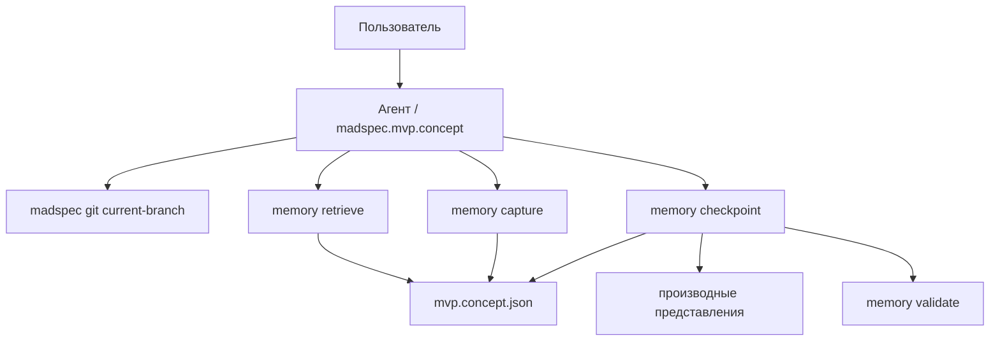
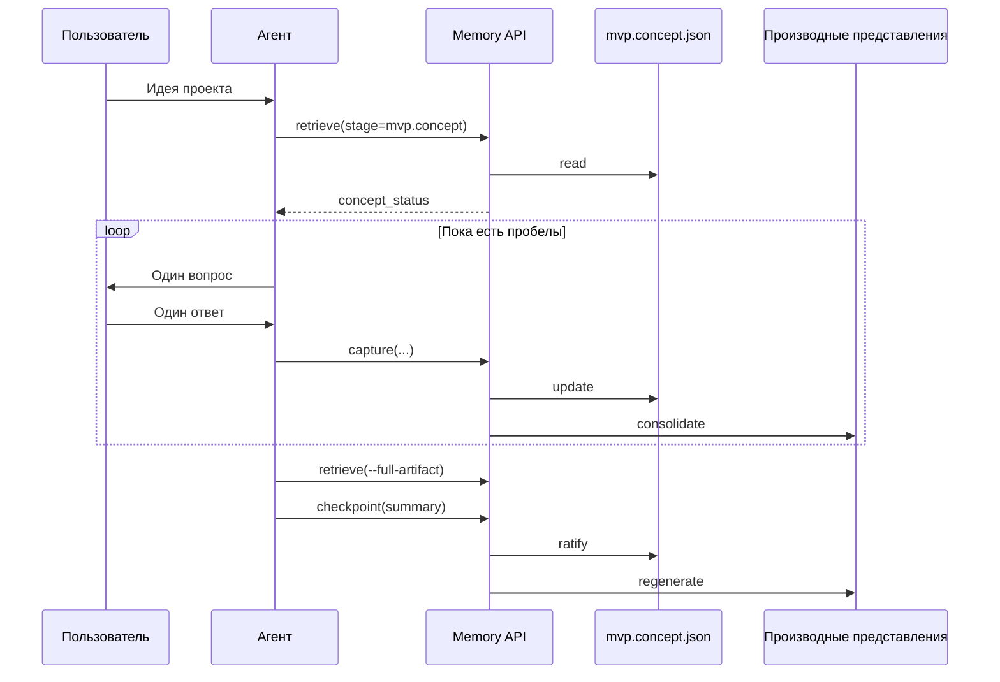
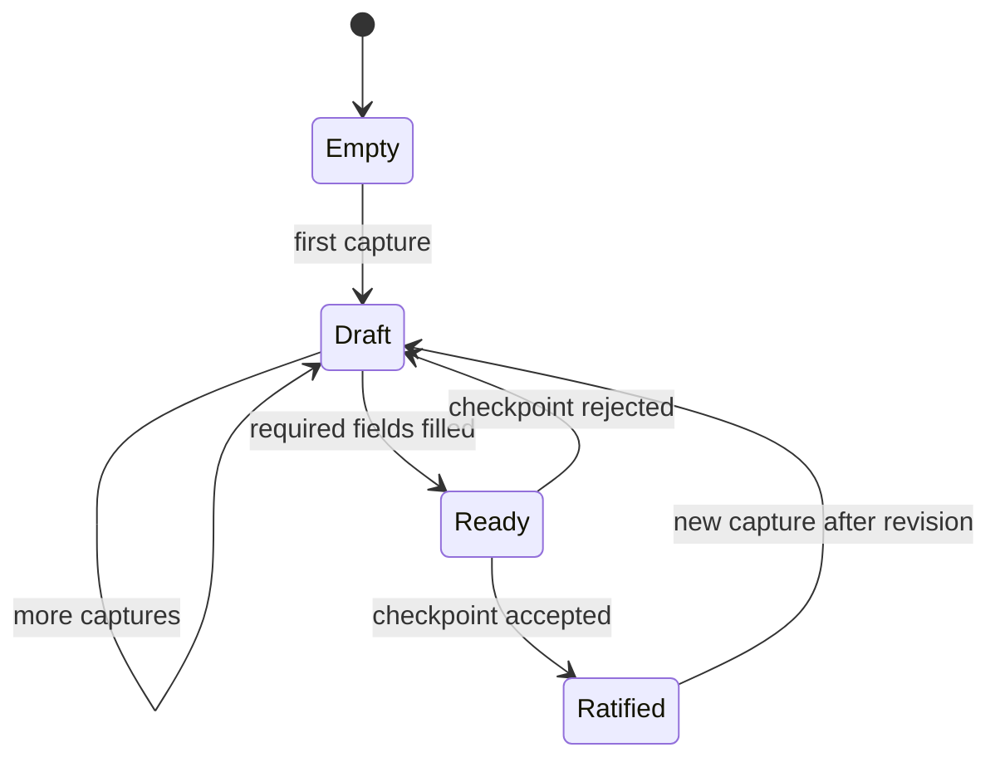
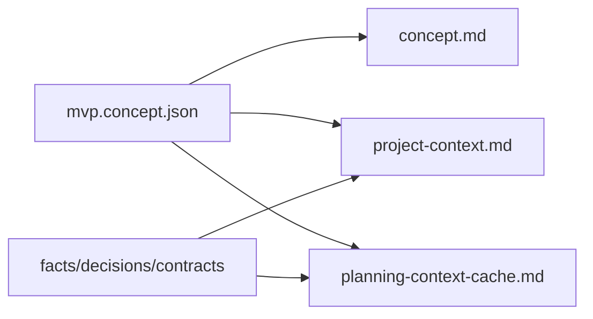

# `madspec.mvp.concept`

## Назначение команды

`madspec.mvp.concept` фиксирует продуктовый замысел нового проекта: что создается, для кого, какую боль решает и какие функции входят в MVP по приоритетам `P1/P2/P3`.

## Когда запускать

- в начале MVP-ветки
- когда продуктовая гипотеза еще не ратифицирована
- когда нужно обновить концепцию после существенного изменения рамок проекта

## Предварительные условия и обязательный контекст

- доступен контекст текущей ветки через `madspec git current-branch`
- доступен `.madspec/<BRANCH>/memory/`
- ручное редактирование `concept.md` не используется как источник истины
- перед началом работы агент обязан прочитать и использовать навык `madspec-cli-operator`

## Источник истины

### Каноническое состояние

- `.madspec/<BRANCH>/memory/stages/mvp.concept.json`

### Рабочее состояние

- `.madspec/<BRANCH>/memory/working/active-session.json`
- `.madspec/<BRANCH>/memory/working/decision-log.jsonl`
- `.madspec/<BRANCH>/memory/semantic/*.jsonl`

### Производные представления

- `.madspec/<BRANCH>/concept.md`
- `.madspec/<BRANCH>/project-context.md`
- `.madspec/<BRANCH>/planning-context-cache.md`

## Входы команды

- пользовательский ввод с описанием идеи
- `madspec memory retrieve --stage mvp.concept --toon-output`, если этот контекст читает агент
- `madspec memory capture --stage mvp.concept ...`
- `madspec memory checkpoint --stage mvp.concept --summary ...`

Поля `capture`, относящиеся к этой стадии:

- `--project-name`
- `--system-overview`
- `--audience`
- `--scenario`
- `--pain`
- `--feature-p1`, `--feature-p2`, `--feature-p3`
- `--constraint`
- `--assumption`
- `--next-action`

## Пошаговый процесс выполнения

1. Агент определяет ветку через `madspec git current-branch`.
2. Загружает `concept_status` через `retrieve`.
3. Задает вопросы по одному и после каждого подтвержденного блока пишет `capture`.
4. На каждом `capture` система обновляет `mvp.concept.json`, семантические записи и производные представления.
5. Перед финалом агент запрашивает `--full-artifact`.
6. `checkpoint` ратифицирует стадию, обновляет `checkpointSummary`, `ratifiedAt`, `updatedAt`, `revision`.

## Каноническая модель данных

Ключевые поля `mvp.concept.json`:

- `projectName`
- `systemOverview`
- `audiences[]`
- `scenarios[]`
- `painPoints[]`
- `features.p1[]`, `features.p2[]`, `features.p3[]`
- `constraints[]`
- `assumptions[]`
- `nextActions[]`
- `checkpointSummary`
- `ratifiedAt`, `updatedAt`, `revision`

Обязательные поля для checkpoint:

- `systemOverview`
- минимум один `audience`
- минимум один `scenario`
- минимум один `painPoint`
- минимум одна функция в `features.p1`

## Производные артефакты

- `concept.md` — человекочитаемое описание концепции
- `project-context.md` — сводка по ветке и ссылки на артефакты
- `planning-context-cache.md` — сжатый кэш памяти для следующих стадий

## Диаграммы

## Типовые ошибки, расхождения и ограничения

- `concept.md` отредактирован вручную и больше не совпадает с `mvp.concept.json`
- агент пытается синтезировать отсутствующее поле без `retrieve`
- checkpoint выполняется до появления `systemOverview` или `P1` feature
- пользовательский чат используется как источник истины вместо состояния стадии

## Соседние команды и передача дальше

- предыдущая команда: обычно начало процесса
- следующая команда: [`madspec.mvp.design`](./madspec.mvp.design.md)

## Что не является источником истины

- `.madspec/<BRANCH>/concept.md`
- устный контекст текущего чата
- любые промежуточные заметки вне `.madspec/<BRANCH>/memory/`
