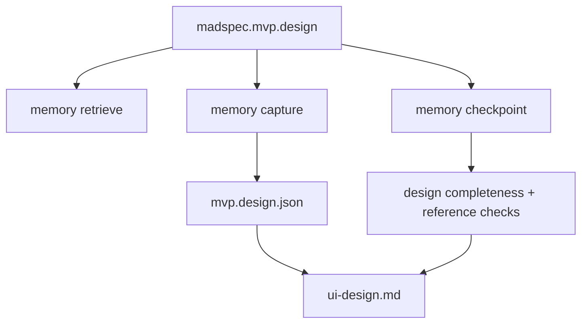

# `madspec.mvp.design`

## Назначение команды

`madspec.mvp.design` фиксирует UX/UI проекта как готовую к проверке раскадровку: платформы, зоны, экраны, пользовательские маршруты, навигацию и покрытие функций из `concept` через состояние дизайна и файлы прототипов.

## Когда запускать

- после ратификации `mvp.concept`
- когда нужно зафиксировать структуру интерфейса до выбора технологий
- при значимых изменениях экранов, потоков или покрытия прототипами

## Предварительные условия и обязательный контекст

- существует завершенный `mvp.concept`
- доступны пути прототипов в `.madspec/<BRANCH>/ui-prototype/`
- ссылки в дизайне должны указывать на существующие `screens`, `zones` и файлы прототипов
- доступен `.madspec/templates/ui-storyboard-contract.md` как структурное руководство для прототипа
- перед началом работы агент обязан прочитать и использовать навык `madspec-cli-operator`
- для UI/UX-проектирования и прототипов-раскадровок агент обязан использовать навык `frontend-design` как основной профиль проектирования

## Источник истины

### Каноническое состояние

- `.madspec/<BRANCH>/memory/stages/mvp.design.json`

### Рабочее состояние

- `active-session.json`
- семантические записи по стадии
- покрытие функций вычисляется из `screens[].covers`

### Производные представления

- `.madspec/<BRANCH>/ui-design.md`
- `.madspec/<BRANCH>/project-context.md`

## Входы команды

- пользовательские требования к UX/UI
- `madspec memory retrieve --stage mvp.design --toon-output`, если этот контекст читает агент
- `madspec memory capture --stage mvp.design ...`
- `madspec memory checkpoint --stage mvp.design --summary ...`
- `.madspec/templates/ui-storyboard-contract.md`
- навык `frontend-design` для визуальных UI/UX-решений

Ключевые флаги:

- `--design-overview`
- `--platform`
- `--zone`
- `--screen`
- `--screen-feature`
- `--flow`
- `--flow-step`
- `--flow-alternative`
- `--nav`
- `--platform-constraint`
- `--screen-data`
- `--next-action`

## Пошаговый процесс выполнения

1. Агент читает `concept` и затем `design_status`.
2. Перед основной работой обязательно подключает навык `madspec-cli-operator` как базовый навык процесса и CLI.
3. Для визуального UI/UX-проектирования обязательно подключает навык `frontend-design`; `ui-storyboard-contract` при этом используется как структурный контракт, а не как источник визуального стиля.
3. Выделяет основной маршрут проверки и остальные пользовательские сценарии, которые нужно пройти кликами.
4. По мере согласования экранов и потоков пишет `capture`.
5. Система обновляет `zones`, `screens`, `flows`, `navigation`, `platformConstraints`.
6. `design_completeness_errors()` проверяет платформы, экраны, потоки, навигацию и покрытие всех функций из `concept`.
7. `design_reference_errors()` проверяет ссылки на неизвестные `screen` и `zone`, а также отсутствие файлов прототипов.
8. После полного покрытия и утверждения раскадровки выполняется `checkpoint`.

## Каноническая модель данных

Ключевые поля `mvp.design.json`:

- `designOverview`
- `platforms[]`
- `zones[]`
- `screens[]`
- `flows[]`
- `navigation[]`
- `platformConstraints[]`
- `nextActions[]`
- `checkpointSummary`
- `ratifiedAt`, `updatedAt`, `revision`

Обязательные условия checkpoint:

- есть `designOverview`
- есть хотя бы одна `platform`
- есть хотя бы один `screen`
- есть хотя бы один `flow`
- есть `navigation`
- все concept features покрыты через `screens[].covers`
- все prototype paths существуют
- ровно один экран ссылается на `.madspec/<BRANCH>/ui-prototype/index.html`
- первый шаг первого `flow` ссылается именно на этот экран

Интерпретация раскадровки:

- `flows[].steps` = канонический порядок пользовательского маршрута для проверки
- первый step каждого flow = входной экран сценария
- первый `flow` = основной маршрут проверки
- `index.html` = реальная точка входа приложения для основного маршрута, а не обзорная HTML-страница
- `screens[].covers` остаются внутренним слоем покрытия и не обязаны отображаться в пользовательском артефакте дизайна

## Производные артефакты

- `ui-design.md`
- файлы прототипов в `.madspec/<BRANCH>/ui-prototype/` используются как утвержденный контракт раскадровки для проверки и передачи дальше

## Диаграммы

## Типовые ошибки, расхождения и ограничения

- экран ссылается на неизвестную `zone`
- flow step ссылается на неизвестный `screenId`
- `prototype` path отсутствует в репозитории
- часть функций из `concept` не покрыта состоянием дизайна
- `ui-design.md` обновлен вручную и расходится с состоянием стадии
- `index.html` ведет себя как обзорная страница вместо реальной точки входа приложения
- primary journey нельзя пройти кликами без ручного перехода по URL

## Соседние команды и передача дальше

- предыдущая команда: [`madspec.mvp.concept`](./madspec.mvp.concept.md)
- следующая команда: [`madspec.mvp.tech`](./madspec.mvp.tech.md)

## Что не является источником истины

- `.madspec/<BRANCH>/ui-design.md`
- HTML-прототип как самостоятельный основной источник без `mvp.design.json`
- устное описание экранов, не зафиксированное через `capture`
