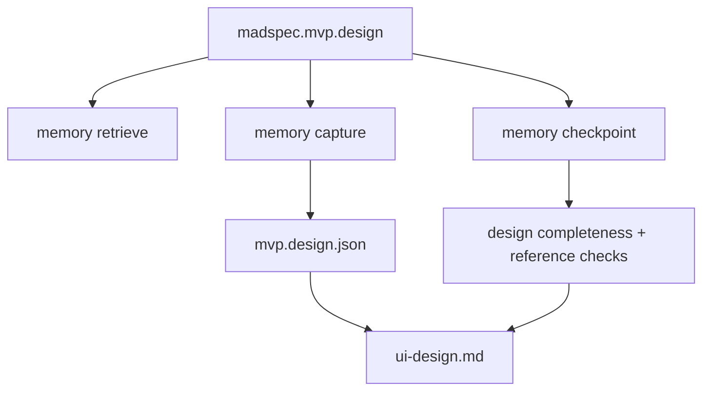

# `madspec.mvp.design`

## Назначение команды

`madspec.mvp.design` фиксирует UX/UI проекта как review-ready storyboard: платформы, зоны, экраны, journeys, навигацию и coverage concept features через design-state и prototype files.

## Когда запускать

- после ратификации `mvp.concept`
- когда нужно зафиксировать структуру интерфейса до выбора технологий
- при значимых изменениях экранов, flow или prototype coverage

## Preconditions / required context

- существует завершенный `mvp.concept`
- доступны prototype paths в `.madspec/<BRANCH>/ui-prototype/`
- design references должны указывать на существующие screens, zones и prototype files
- доступен `.madspec/templates/ui-storyboard-contract.md` как structural guide для прототипа
- перед началом работы агент обязан прочитать и использовать skill `madspec-cli-operator`
- для UI/UX-проектирования и storyboard-прототипов агент обязан использовать skill `frontend-design` как основной design-skill

## Источник истины

### Canonical state

- `.madspec/<BRANCH>/memory/stages/mvp.design.json`

### Runtime / working state

- `active-session.json`
- semantic records по stage
- feature coverage вычисляется из `screens[].covers`

### Generated views

- `.madspec/<BRANCH>/ui-design.md`
- `.madspec/<BRANCH>/project-context.md`

## Входы команды

- пользовательские требования к UX/UI
- `madspec memory retrieve --stage mvp.design --toon-output`, если этот контекст читает агент
- `madspec memory capture --stage mvp.design ...`
- `madspec memory checkpoint --stage mvp.design --summary ...`
- `.madspec/templates/ui-storyboard-contract.md`
- skill `frontend-design` для visual/UI/UX design-решений

Ключевые flags:

- `--design-overview`
- `--platform`
- `--zone`
- `--screen`
- `--screen-feature`
- `--flow`
- `--flow-step`
- `--flow-alternative`
- `--nav`
- `--platform-constraint`
- `--screen-data`
- `--next-action`

## Пошаговый runtime workflow

1. Агент читает `concept` и затем `design_status`.
2. Перед основной работой обязательно подключает skill `madspec-cli-operator` как базовый workflow/CLI skill.
3. Для visual/UI/UX-проектирования обязательно подключает skill `frontend-design`; `ui-storyboard-contract` при этом используется как structural contract, а не как источник визуального стиля.
3. Выделяет primary review flow и остальные journeys, которые пользователь должен пройти кликами.
4. По мере согласования экранов и потоков пишет `capture`.
5. Runtime обновляет `zones`, `screens`, `flows`, `navigation`, `platformConstraints`.
6. `design_completeness_errors()` проверяет platforms, screens, flows, navigation и coverage всех concept features.
7. `design_reference_errors()` проверяет links на неизвестные screen/zone и отсутствие prototype files.
8. После полного покрытия и approval storyboard выполняется `checkpoint`.

## Canonical data model

Ключевые поля `mvp.design.json`:

- `designOverview`
- `platforms[]`
- `zones[]`
- `screens[]`
- `flows[]`
- `navigation[]`
- `platformConstraints[]`
- `nextActions[]`
- `checkpointSummary`
- `ratifiedAt`, `updatedAt`, `revision`

Обязательные условия checkpoint:

- есть `designOverview`
- есть хотя бы одна `platform`
- есть хотя бы один `screen`
- есть хотя бы один `flow`
- есть `navigation`
- все concept features покрыты через `screens[].covers`
- все prototype paths существуют

Интерпретация storyboard:

- `flows[].steps` = canonical порядок review journey
- первый step каждого flow = entry screen сценария
- первый flow = primary review flow
- `screens[].covers` остаются internal coverage-слоем и не обязаны рендериться в user-facing design artifact

## Generated artifacts

- `ui-design.md`
- prototype files в `.madspec/<BRANCH>/ui-prototype/` используются как approved storyboard contract для review и handoff

## Диаграммы

## Типовые ошибки / drift / ограничения

- экран ссылается на неизвестную `zone`
- flow step ссылается на неизвестный `screenId`
- `prototype` path отсутствует в репозитории
- часть concept features не покрыта design-state
- `ui-design.md` обновлен вручную и расходится с stage-state
- `index.html` ведет себя как каталог файлов вместо storyboard entrypoint
- primary journey нельзя пройти кликами без ручного перехода по URL

## Соседние команды и handoff

- предыдущая команда: [`madspec.mvp.concept`](./madspec.mvp.concept.md)
- следующая команда: [`madspec.mvp.tech`](./madspec.mvp.tech.md)

## Что не является источником истины

- `.madspec/<BRANCH>/ui-design.md`
- HTML prototype как отдельный primary source без `mvp.design.json`
- устное описание экранов, не зафиксированное через `capture`
