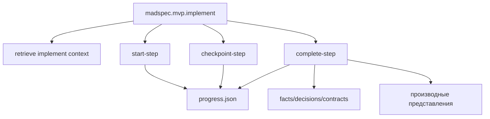
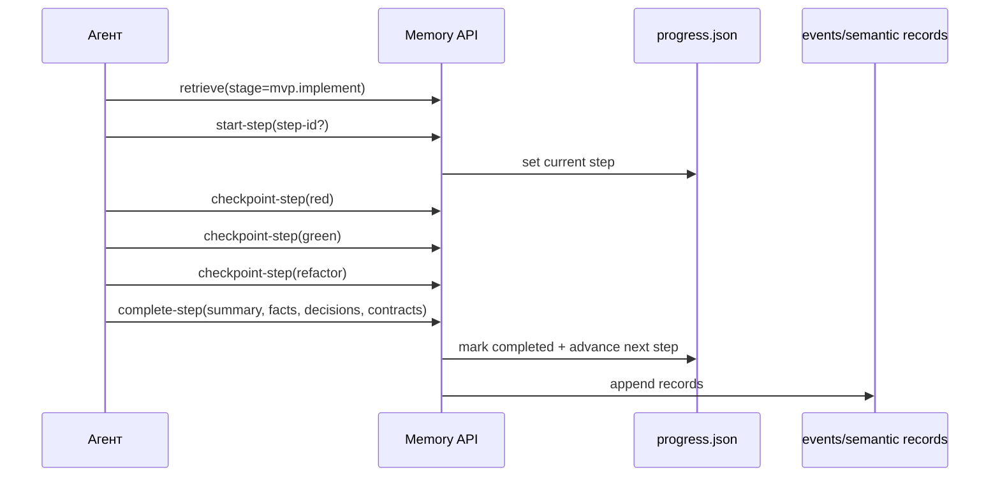
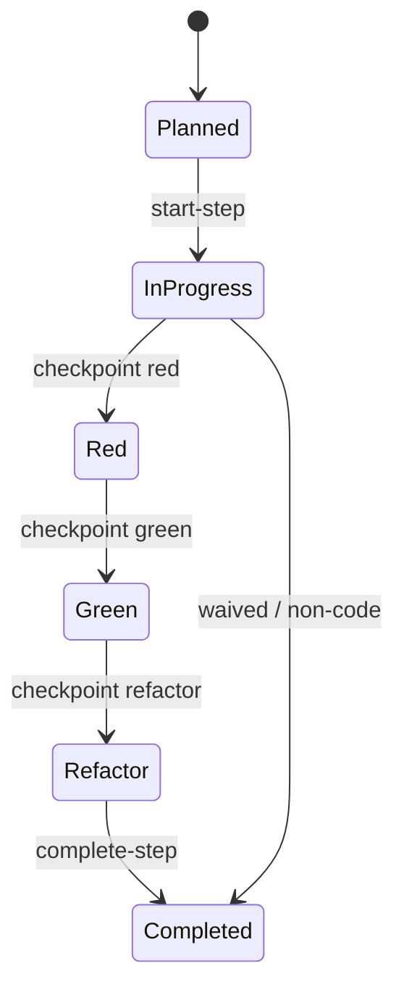
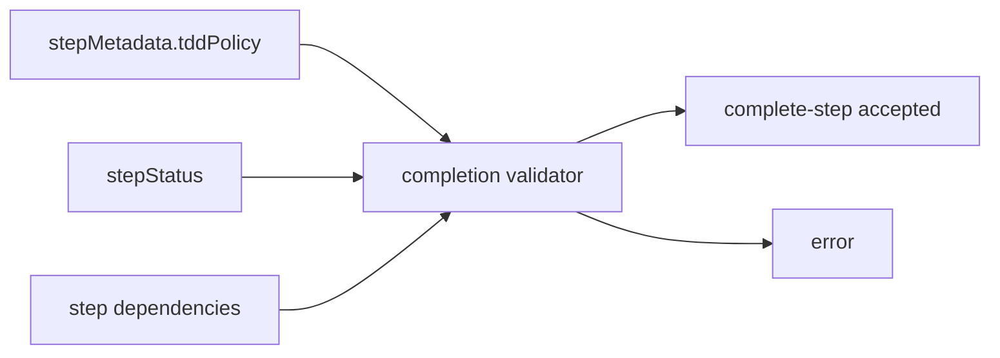

# `madspec.mvp.implement`

## Назначение команды

`madspec.mvp.implement` выполняет запланированные шаги реализации через пошаговое состояние выполнения, контрольные точки TDD и записи о завершении.

## Когда запускать

- после появления каталога шагов в `mvp.plan`
- для выполнения очередного исполнимого шага
- при возобновлении работы над уже начатым шагом

## Предварительные условия и обязательный контекст

- существуют `.madspec/<BRANCH>/implementation-plan.md` и `progress.json`
- шаги уже зарегистрированы через `mvp.plan`
- для шагов с кодом действует дисциплина TDD
- для UI-шагов утвержденные прототипы из `.madspec/<BRANCH>/ui-prototype/` считаются UI-контрактом, а не необязательным справочным материалом
- перед началом работы агент обязан прочитать и использовать навык `madspec-cli-operator`

## Источник истины

### Каноническое состояние выполнения

- `.madspec/<BRANCH>/memory/progress.json`
- `.madspec/<BRANCH>/memory/working/active-session.json`

### Знания уровня шага

- `events.jsonl`
- `facts.jsonl`
- `decisions.jsonl`
- `contracts.jsonl`

### Производные представления

- `.madspec/<BRANCH>/implementation-plan.md`
- `.madspec/<BRANCH>/steps/<step-id>/implementation-context.md`
- `.madspec/<BRANCH>/project-context.md`

## Входы команды

- `madspec memory retrieve --stage mvp.implement --toon-output`, если этот контекст читает агент
- `madspec memory start-step --stage mvp.implement`
- `madspec memory checkpoint-step --stage mvp.implement`
- `madspec memory complete-step --stage mvp.implement`
- `madspec git commit --message ...`

Из `retrieve` агент обязан читать `policy_context.required`, `policy_context.advisory` и текущие результаты проверки правил. При неочевидных блокировках допускается отдельный `madspec policy validate --stage mvp.implement --step-id <step-id> --toon-output`, если этот вывод читает агент.

## Пошаговый процесс выполнения

1. Агент читает контекст реализации через `retrieve`.
2. Агент сверяет выбранный шаг с `policy_context` и обязательными действующими правилами.
3. Запускает шаг через `start-step`, явно или по `nextExecutableStep`.
4. Для шагов с кодом фиксирует `red`, `green`, `refactor` через `checkpoint-step`.
5. Для UI-шагов реализация сверяется с утвержденной раскадровкой из `ui-prototype/index.html` и связанных экранов.
6. `complete-step` закрывает шаг, записывает семантические записи и продвигает `currentImplementStep`.
7. После успешного завершения агент создает git commit.

## Каноническая модель данных

Ключевые поля состояния выполнения:

- `plannedSteps[]`
- `completedSteps[]`
- `currentImplementStep`
- `stepStatus[stepId].status`
- `stepStatus[stepId].tddPhase`
- `stepStatus[stepId].redEvidence[]`
- `stepStatus[stepId].greenEvidence[]`
- `stepStatus[stepId].refactorNote`
- `stepMetadata[stepId]`

Правила завершения:

- `summary` обязателен
- step должен существовать в `plannedSteps`
- зависимости шага должны быть завершены
- для `code + required` обязательны `redEvidence`, `greenEvidence`, `refactorNote`
- после завершения шаг переходит в `completed`, а система выбирает следующий исполнимый шаг

## Производные артефакты

- обновленный `implementation-plan.md`
- `steps/<step-id>/implementation-context.md`
- `project-context.md`

## Диаграммы

## Типовые ошибки, расхождения и ограничения

- `progress.json` редактируется вручную
- step завершается без TDD evidence при `tddPolicy=required`
- шаг запускается до завершения зависимостей
- агент ориентируется на имя директории, а не на `retrieve/start-step` output
- UI реализуется "примерно похоже", но расходится с утвержденным storyboard без обновления `mvp.design`

## Соседние команды и передача дальше

- предыдущая команда: [`madspec.mvp.plan`](./madspec.mvp.plan.md)
- соседние quality-команды: [`madspec.review`](../other/madspec.review.md), [`madspec.security`](../other/madspec.security.md)

## Что не является источником истины

- `.madspec/<BRANCH>/implementation-plan.md`
- `.madspec/<BRANCH>/steps/<step-id>/implementation-context.md`
- ручные изменения состояния выполнения без пошаговых команд
