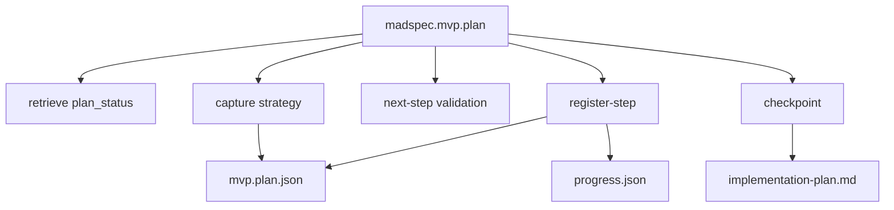
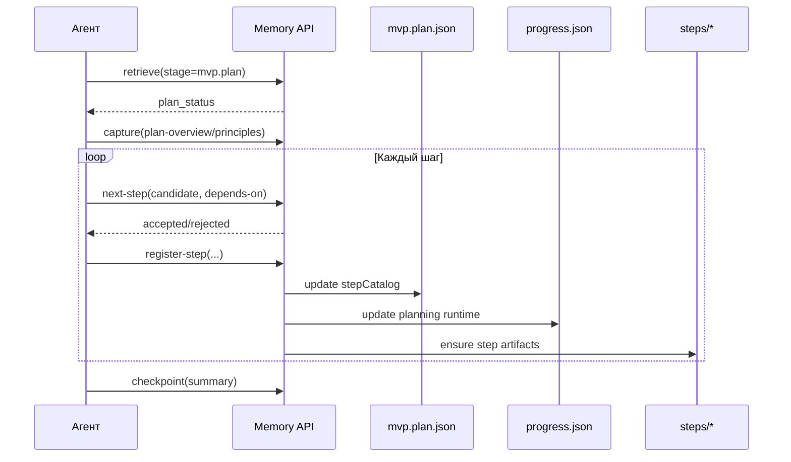
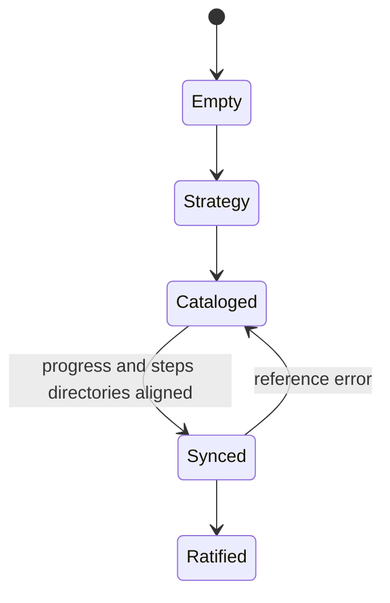
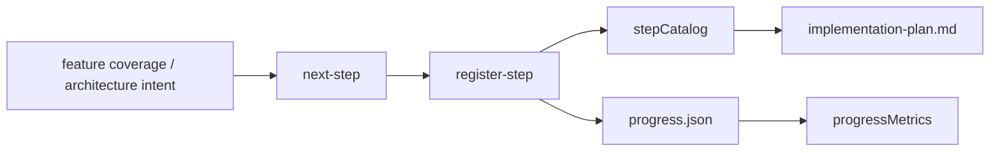

# `madspec.mvp.plan`

## Назначение команды

`madspec.mvp.plan` строит step catalog реализации и синхронизирует planning state с `progress.json`, step directories и generated planning views.

Команда должна стремиться к минимально достаточному числу шагов: для простой задачи агент выбирает один полный шаг, а не несколько искусственно раздробленных.

## Когда запускать

- после `mvp.architecture`
- каждый раз, когда нужно добавить или уточнить шаги реализации
- до начала `mvp.implement`

## Preconditions / required context

- завершены предыдущие MVP стадии
- существует или может быть создан `.madspec/<BRANCH>/memory/progress.json`
- `currentImplementStep` нельзя менять вручную
- перед началом работы агент обязан прочитать и использовать skill `madspec-cli-operator`

## Источник истины

### Canonical state

- `.madspec/<BRANCH>/memory/stages/mvp.plan.json`
- `.madspec/<BRANCH>/memory/progress.json`

### Runtime / working state

- `planningMetadata.stepDependencies`
- `stepMetadata`
- `stepStatus`
- `coversFunctions`
- `plannedSteps`

### Generated views

- `.madspec/<BRANCH>/implementation-plan.md`
- `.madspec/<BRANCH>/planning-context-cache.md`
- `.madspec/<BRANCH>/steps/<step-id>/planning-context.md`
- `.madspec/<BRANCH>/project-context.md`

## Входы команды

- `madspec memory retrieve --stage mvp.plan --toon-output`, если этот контекст читает агент
- `madspec memory capture --stage mvp.plan --plan-overview ... --planning-principle ... --next-action ...`
- `madspec memory next-step --stage mvp.plan --candidate-step ...`
- `madspec memory register-step --stage mvp.plan ...`
- `madspec memory checkpoint --stage mvp.plan --summary ...`

Из `retrieve` агент обязан прочитать `policy_context.required`, `policy_context.advisory` и `policy_context.pending_proposals_count`, потому что planning decisions теперь проходят через project-global policy layer.

## Пошаговый runtime workflow

1. Агент читает `mvp.architecture` и затем `plan_status`.
2. Агент читает `policy_context` и сверяет новый шаг с active policies текущей стадии.
3. Определяет максимально крупный безопасный шаг для текущей итерации.
4. Фиксирует planning strategy через `capture`.
5. Для каждого нового шага проверяет ID и зависимости через `next-step`.
6. Регистрирует шаг через `register-step`, а не через ручное редактирование JSON.
7. Runtime обновляет `mvp.plan.json`, `progress.json`, step metadata, dependency graph и progress metrics.
8. После серии изменений агент ратифицирует stage через `checkpoint`.

## Правила гранулярности шага

- Предпочитай максимально крупный безопасный шаг, который можно реализовать и проверить за один проход `mvp.implement`.
- Если задача маленькая и имеет одну цель, создавай один шаг даже если он затрагивает код, тесты, конфигурацию и документацию одновременно.
- Не выделяй отдельно шаги вида "подготовить", "дописать тесты", "обновить документацию" и "провести валидацию", если это части одной и той же поставки.
- Делить работу на несколько шагов нужно только при реальных зависимостях, разных точках пользовательской проверки, заметно разных рисках или явной просьбе пользователя о более детальном плане.
- Если есть сомнение между двумя и тремя шагами без явной причины, выбирай меньшее число шагов.

## Canonical data model

`mvp.plan.json`:

- `planOverview`
- `planningPrinciples[]`
- `stepCatalog[]`
- `nextActions[]`
- `checkpointSummary`
- `ratifiedAt`, `updatedAt`, `revision`

`progress.json` синхронно отражает:

- `plannedSteps[]`
- `completedSteps[]`
- `currentImplementStep`
- `stepMetadata`
- `stepStatus`
- `planningMetadata.stepDependencies`
- `planningMetadata.progressMetrics`
- `coversFunctions`

Обязательные условия checkpoint:

- есть `planOverview`
- `stepCatalog` не пуст
- каждый step имеет валидные `title`, `stepKind`, `tddPolicy`, `size`, `complexity`

Reference checks:

- каждый planned step присутствует в `stepCatalog`
- существует `steps/<step-id>/`
- существуют `description.md`, `tasks.md`, `tests.md`, `validation.md`
- `dependsOn`, `covers`, `stepKind`, `tddPolicy` синхронизированы с `progress.json`

## Generated artifacts

- `implementation-plan.md`
- `planning-context-cache.md`
- `steps/<step-id>/planning-context.md`
- `project-context.md`

## Диаграммы

## Типовые ошибки / drift / ограничения

- ручное изменение `currentImplementStep`
- шаг добавлен в `progress.json`, но не зарегистрирован через `register-step`
- отсутствуют обязательные step files
- dependency graph в `planningMetadata` не совпадает с `stepCatalog`

## Соседние команды и handoff

- предыдущая команда: [`madspec.mvp.architecture`](./madspec.mvp.architecture.md)
- следующая команда: [`madspec.mvp.implement`](./madspec.mvp.implement.md)

## Что не является источником истины

- `.madspec/<BRANCH>/implementation-plan.md`
- `.madspec/<BRANCH>/planning-context-cache.md`
- ручные правки `progress.json`
