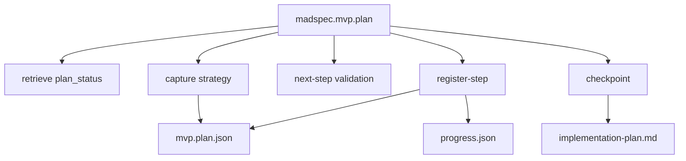
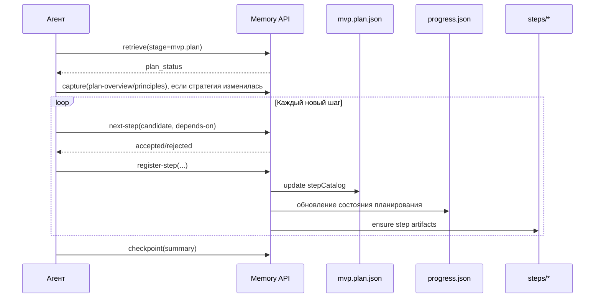
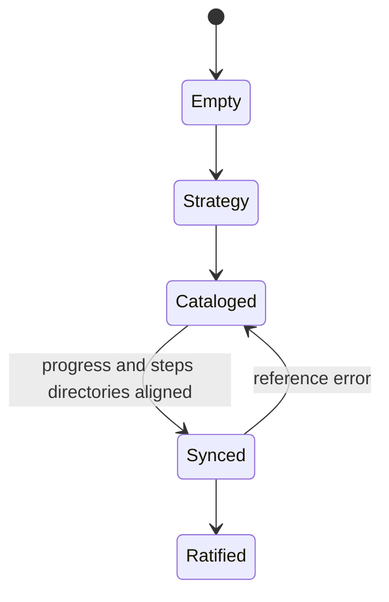
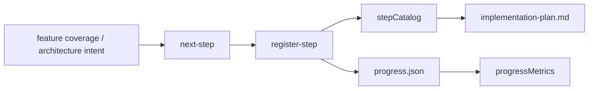

# `madspec.mvp.plan`

## Назначение команды

`madspec.mvp.plan` строит каталог шагов реализации и синхронизирует состояние планирования с `progress.json`, директориями шагов и производными представлениями плана.

Команда должна стремиться к минимально достаточному числу шагов: для простой задачи агент выбирает один полный шаг, а не несколько искусственно раздробленных.
Повторные запуски команды нужны только тогда, когда после текущего прохода реально остаются новые шаги или меняется стратегия плана.

## Когда запускать

- после `mvp.architecture`
- после `madspec.deploy`, если для ветки уже зафиксирован план развертывания
- каждый раз, когда нужно добавить или уточнить шаги реализации
- до начала `mvp.implement`

## Предварительные условия и обязательный контекст

- завершены предыдущие MVP стадии
- существует или может быть создан `.madspec/<BRANCH>/memory/progress.json`
- `currentImplementStep` нельзя менять вручную
- перед началом работы агент обязан прочитать и использовать навык `madspec-cli-operator`

## Источник истины

### Каноническое состояние

- `.madspec/<BRANCH>/memory/stages/mvp.plan.json`
- `.madspec/<BRANCH>/memory/progress.json`

### Рабочее состояние

- `planningMetadata.stepDependencies`
- `stepMetadata`
- `stepStatus`
- `coversFunctions`
- `plannedSteps`

### Производные представления

- `.madspec/<BRANCH>/implementation-plan.md`
- `.madspec/<BRANCH>/planning-context-cache.md`
- `.madspec/<BRANCH>/steps/<step-id>/planning-context.md`
- `.madspec/<BRANCH>/project-context.md`

## Входы команды

- `madspec memory retrieve --stage mvp.plan --toon-output`, если этот контекст читает агент
- `madspec memory capture --stage mvp.plan --plan-overview ... --planning-principle ... --next-action ...`
- `madspec memory next-step --stage mvp.plan --candidate-step ...`
- `madspec memory register-step --stage mvp.plan ...`
- `madspec memory checkpoint --stage mvp.plan --summary ...`
- `.madspec/<BRANCH>/deployment.md`, если этот файл существует

Из `retrieve` агент обязан прочитать `policy_context.required`, `policy_context.advisory` и `policy_context.pending_proposals_count`, потому что решения по планированию теперь проходят через общий проектный слой правил.

## Пошаговый процесс выполнения

1. Агент читает `mvp.architecture`, при наличии `deployment.md`, а затем `plan_status`.
2. Агент читает `policy_context` и сверяет новый шаг с действующими правилами текущей стадии.
3. Определяет максимально крупный безопасный шаг для текущей итерации.
4. При необходимости фиксирует стратегию планирования через `capture`; если стратегия уже достаточна и не меняется, лишний `capture` не нужен.
5. Для каждого действительно нового шага проверяет ID и зависимости через `next-step`.
6. Регистрирует шаг через `register-step`, а не через ручное редактирование JSON.
7. Система обновляет `mvp.plan.json`, `progress.json`, метаданные шагов, граф зависимостей и метрики прогресса.
8. После завершенного прохода агент ратифицирует стадию через один итоговый `checkpoint`.
9. Для UI-шагов агент явно фиксирует в step artifacts конкретные screen-прототипы, flow и входной экран, которые задают acceptance contract.
10. Если существует `deployment.md`, агент учитывает требования к конфигурации, секретам, миграциям, наблюдаемости и откату в шагах, тестах и проверке результата.

## Правила гранулярности шага

- Предпочитай максимально крупный безопасный шаг, который можно реализовать и проверить за один проход `mvp.implement`.
- Если задача маленькая и имеет одну цель, создавай один шаг даже если он затрагивает код, тесты, конфигурацию и документацию одновременно.
- Не выделяй отдельно шаги вида "подготовить", "дописать тесты", "обновить документацию" и "провести валидацию", если это части одной и той же поставки.
- Делить работу на несколько шагов нужно только при реальных зависимостях, разных точках пользовательской проверки, заметно разных рисках или явной просьбе пользователя о более детальном плане.
- Если есть сомнение между двумя и тремя шагами без явной причины, выбирай меньшее число шагов.
- `p1/p2/p3` в концепции задают приоритеты и покрытие функций, а не обязательное число шагов в плане.

## Каноническая модель данных

`mvp.plan.json`:

- `planOverview`
- `planningPrinciples[]`
- `stepCatalog[]`
- `nextActions[]`
- `checkpointSummary`
- `ratifiedAt`, `updatedAt`, `revision`

`progress.json` синхронно отражает:

- `plannedSteps[]`
- `completedSteps[]`
- `currentImplementStep`
- `stepMetadata`
- `stepStatus`
- `planningMetadata.stepDependencies`
- `planningMetadata.progressMetrics`
- `coversFunctions`

Обязательные условия checkpoint:

- есть `planOverview`
- `stepCatalog` не пуст
- каждый step имеет валидные `title`, `stepKind`, `tddPolicy`, `size`, `complexity`

Проверки согласованности:

- каждый запланированный шаг присутствует в `stepCatalog`
- существует `steps/<step-id>/`
- существуют `description.md`, `tasks.md`, `tests.md`, `validation.md`
- `dependsOn`, `covers`, `stepKind`, `tddPolicy` синхронизированы с `progress.json`

## Производные артефакты

- `implementation-plan.md`
- `planning-context-cache.md`
- `steps/<step-id>/planning-context.md`
- `project-context.md`

## Диаграммы

## Типовые ошибки, расхождения и ограничения

- ручное изменение `currentImplementStep`
- шаг добавлен в `progress.json`, но не зарегистрирован через `register-step`
- отсутствуют обязательные step files
- граф зависимостей в `planningMetadata` не совпадает с `stepCatalog`
- UI-шаг ссылается только на директорию `ui-prototype/`, но не фиксирует нужные `screen`-файлы, flow и входной экран

## Соседние команды и передача дальше

- предыдущая команда: [`madspec.mvp.architecture`](./madspec.mvp.architecture.md)
- связанная дополнительная команда: [`madspec.deploy`](../other/madspec.deploy.md)
- следующая команда: [`madspec.mvp.implement`](./madspec.mvp.implement.md)

## Что не является источником истины

- `.madspec/<BRANCH>/implementation-plan.md`
- `.madspec/<BRANCH>/planning-context-cache.md`
- ручные правки `progress.json`
