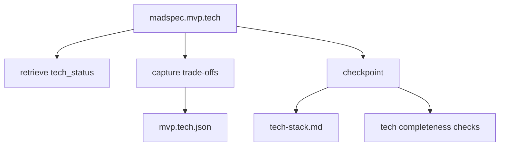
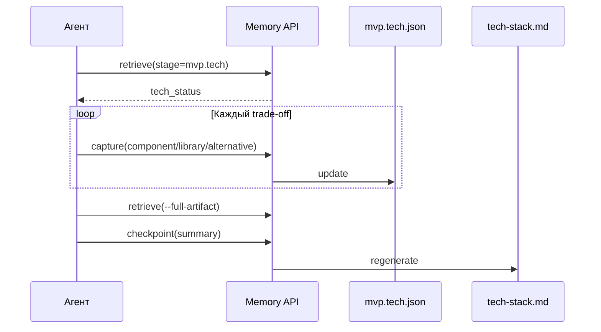
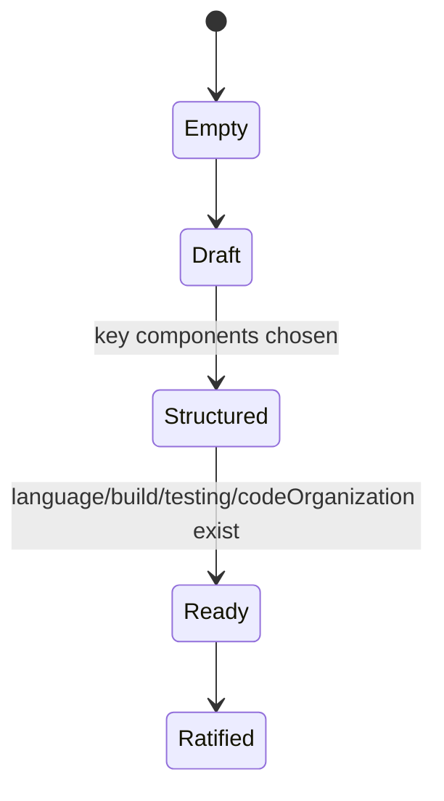
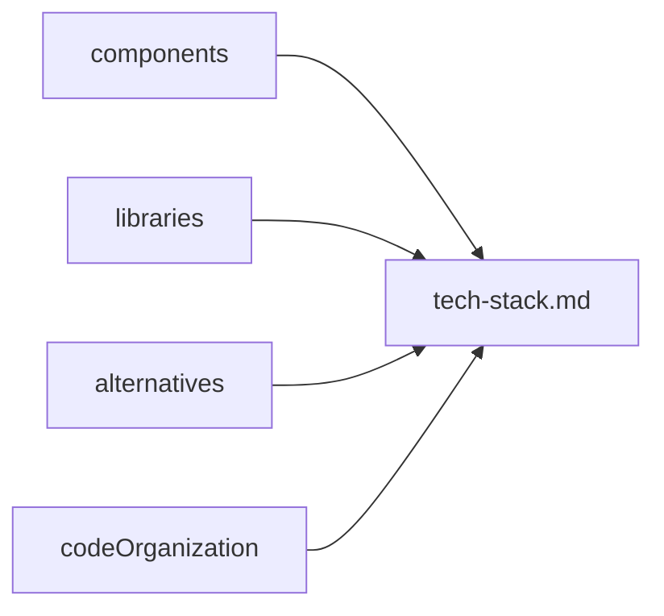

# `madspec.mvp.tech`

## Назначение команды

`madspec.mvp.tech` фиксирует технологический стек, требования, ограничения, code organization и ключевые trade-offs перед архитектурной детализацией.

## Когда запускать

- после `mvp.design`
- когда понятны платформы и UX scope
- когда нужно зафиксировать stack decisions и rejected alternatives

## Preconditions / required context

- есть продуктовый и UI контекст из предыдущих MVP стадий
- agent работает через `tech_status`, а не из памяти чата
- перед началом работы агент обязан прочитать и использовать skill `madspec-cli-operator`

## Источник истины

### Canonical state

- `.madspec/<BRANCH>/memory/stages/mvp.tech.json`

### Runtime / working state

- semantic facts, decisions, contracts
- `active-session.json`

### Generated views

- `.madspec/<BRANCH>/tech-stack.md`
- `.madspec/<BRANCH>/project-context.md`

## Входы команды

- `madspec memory retrieve --stage mvp.tech --toon-output`, если этот контекст читает агент
- `madspec memory capture --stage mvp.tech ...`
- `madspec memory checkpoint --stage mvp.tech --summary ...`

Ключевые поля capture:

- `--project-type`
- `--stack-overview`
- `--requirement`
- `--preference`
- `--tech-constraint`
- `--stack-component`
- `--library`
- `--code-organization`
- `--alternative`
- `--next-action`

## Пошаговый runtime workflow

1. Агент получает `tech_status`.
2. Согласует stack components и libraries по slot-ам.
3. Каждый подтвержденный trade-off пишет через `capture`.
4. Перед финалом читает `artifact_state.tech`.
5. `checkpoint` проверяет completeness и пересобирает `tech-stack.md`.

## Canonical data model

Ключевые поля:

- `projectType`
- `stackOverview`
- `requirements[]`
- `preferences[]`
- `constraints[]`
- `components[]`
- `libraries[]`
- `codeOrganization`
- `alternatives[]`
- `nextActions[]`
- `checkpointSummary`
- `ratifiedAt`, `updatedAt`, `revision`

Обязательные поля checkpoint:

- `projectType`
- `stackOverview`
- минимум один component со slot `language`
- минимум один component со slot `build`
- минимум один testing component (`unit-testing`, `integration-testing`, `e2e-testing` или `testing`)
- `codeOrganization`

## Generated artifacts

- `tech-stack.md`
- `project-context.md`

## Диаграммы

## Типовые ошибки / drift / ограничения

- testing slot не зафиксирован
- `tech-stack.md` не совпадает с render из state
- decisions по стеку обсуждены в чате, но не сохранены через `capture`
- build/deploy considerations забыты, хотя их требует выбранный стек

## Соседние команды и handoff

- предыдущая команда: [`madspec.mvp.design`](./madspec.mvp.design.md)
- следующая команда: [`madspec.mvp.architecture`](./madspec.mvp.architecture.md)

## Что не является источником истины

- `.madspec/<BRANCH>/tech-stack.md`
- список зависимостей, не зафиксированный в `mvp.tech.json`
