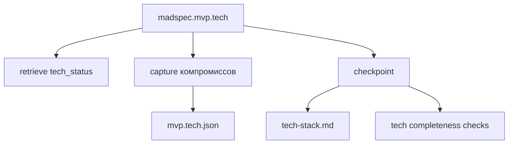
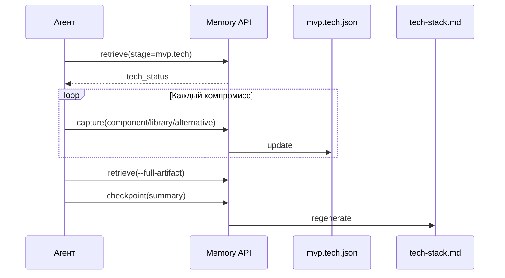
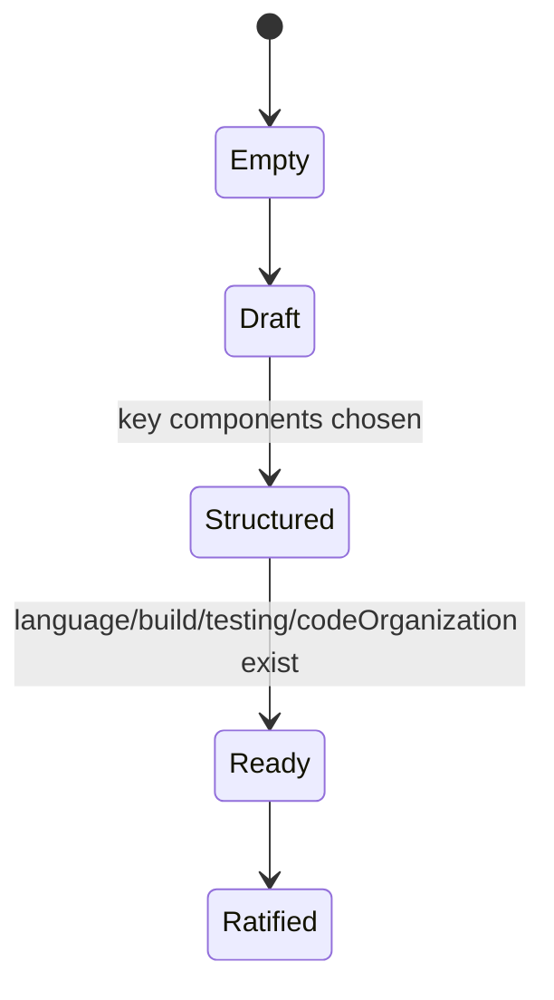
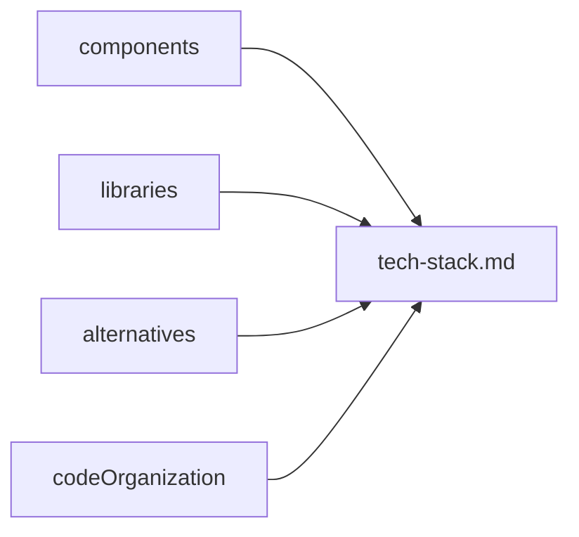

# `madspec.mvp.tech`

## Назначение команды

`madspec.mvp.tech` фиксирует технологический стек, требования, ограничения, организацию кода и ключевые компромиссы перед архитектурной детализацией.

## Когда запускать

- после `mvp.design`
- когда понятны платформы и рамки UX
- когда нужно зафиксировать решения по стеку и отвергнутые альтернативы

## Предварительные условия и обязательный контекст

- есть продуктовый и UI контекст из предыдущих MVP стадий
- агент работает через `tech_status`, а не из памяти чата
- перед началом работы агент обязан прочитать и использовать навык `madspec-cli-operator`

## Источник истины

### Каноническое состояние

- `.madspec/<BRANCH>/memory/stages/mvp.tech.json`

### Рабочее состояние

- semantic facts, decisions, contracts
- `active-session.json`

### Производные представления

- `.madspec/<BRANCH>/tech-stack.md`
- `.madspec/<BRANCH>/project-context.md`

## Входы команды

- `madspec memory retrieve --stage mvp.tech --toon-output`, если этот контекст читает агент
- `madspec memory capture --stage mvp.tech ...`
- `madspec memory checkpoint --stage mvp.tech --summary ...`

Ключевые поля `capture`:

- `--project-type`
- `--stack-overview`
- `--requirement`
- `--preference`
- `--tech-constraint`
- `--stack-component`
- `--library`
- `--code-organization`
- `--alternative`
- `--next-action`

## Пошаговый процесс выполнения

1. Агент получает `tech_status`.
2. Согласует компоненты стека и библиотеки по слотам.
3. Каждый подтвержденный компромисс фиксирует через `capture`.
4. Перед финалом читает `artifact_state.tech`.
5. `checkpoint` проверяет полноту и пересобирает `tech-stack.md`.

## Каноническая модель данных

Ключевые поля:

- `projectType`
- `stackOverview`
- `requirements[]`
- `preferences[]`
- `constraints[]`
- `components[]`
- `libraries[]`
- `codeOrganization`
- `alternatives[]`
- `nextActions[]`
- `checkpointSummary`
- `ratifiedAt`, `updatedAt`, `revision`

Обязательные поля checkpoint:

- `projectType`
- `stackOverview`
- минимум один `component` со слотом `language`
- минимум один `component` со слотом `build`
- минимум один компонент тестирования (`unit-testing`, `integration-testing`, `e2e-testing` или `testing`)
- `codeOrganization`

## Производные артефакты

- `tech-stack.md`
- `project-context.md`

## Диаграммы

## Типовые ошибки, расхождения и ограничения

- слот тестирования не зафиксирован
- `tech-stack.md` не совпадает с представлением, собранным из состояния
- решения по стеку обсуждены в чате, но не сохранены через `capture`
- требования к сборке и развертыванию забыты, хотя их требует выбранный стек

## Соседние команды и передача дальше

- предыдущая команда: [`madspec.mvp.design`](./madspec.mvp.design.md)
- следующая команда: [`madspec.mvp.architecture`](./madspec.mvp.architecture.md)

## Что не является источником истины

- `.madspec/<BRANCH>/tech-stack.md`
- список зависимостей, не зафиксированный в `mvp.tech.json`
