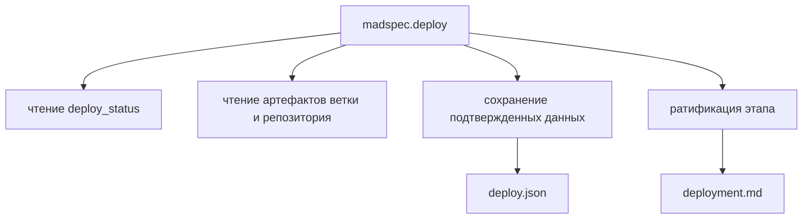
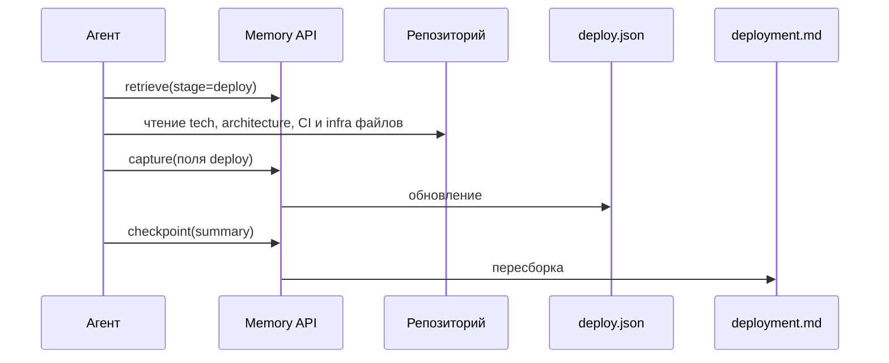

# `madspec.deploy`

## Назначение команды

`madspec.deploy` фиксирует и уточняет план развертывания для текущей ветки. Команда собирает в структурированной памяти сведения об окружениях, единицах развертывания, конфигурации, секретах, конвейере CI/CD, миграциях, наблюдаемости, безопасности, релизе и откате.

## Когда запускать

- после `mvp.architecture`, если ограничения развертывания важны до начала детального планирования;
- в feature-ветке, если изменения затрагивают инфраструктуру, секреты, миграции, наблюдаемость или выпуск релиза;
- отдельно после завершения остальных стадий, если нужно оформить или пересмотреть способ выкладки перед релизом;
- повторно, если фактическая схема развертывания изменилась по ходу работы.

## Предварительные условия и обязательный контекст

- доступна текущая ветка;
- есть репозиторий и хотя бы минимальный технический контекст;
- наличие `tech-stack.md` и `architecture.md` желательно, но их отсутствие не должно полностью блокировать команду;
- перед началом работы агент обязан прочитать и использовать навык `madspec-cli-operator`.

## Источник истины

### Каноническое состояние

- `.madspec/<BRANCH>/memory/stages/deploy.json`

### Производные представления

- `.madspec/<BRANCH>/deployment.md`
- `.madspec/<BRANCH>/project-context.md`

## Входы команды

- `madspec memory retrieve --stage deploy --toon-output`, если этот вывод читает агент
- `madspec memory capture --stage deploy ...`
- `madspec memory checkpoint --stage deploy --summary ...`
- технические и инфраструктурные артефакты проекта:
  - `.madspec/<BRANCH>/tech-stack.md`
  - `.madspec/<BRANCH>/architecture.md`
  - `.madspec/<BRANCH>/project-analysis.md`
  - `.madspec/<BRANCH>/feature-context.md`
  - `.madspec/<BRANCH>/implementation-plan.md`
  - `.madspec/<BRANCH>/review.md`
  - `.madspec/<BRANCH>/security-audit.md`
  - файлы CI, контейнеризации и инфраструктуры

Из `retrieve` агент обязан читать `deploy_status`, `policy_context.required`, `policy_context.advisory` и `change_context`.

## Пошаговый процесс выполнения

1. Агент определяет текущую ветку.
2. Агент читает сводку этапа `deploy` из памяти.
3. Агент изучает доступные технические и инфраструктурные артефакты проекта.
4. Агент определяет, какие сведения можно подтвердить без вопросов пользователю.
5. Если данных недостаточно, агент задает пользователю один уточняющий вопрос.
6. Агент сохраняет подтвержденные сведения через `madspec memory capture --stage deploy`.
7. Агент ратифицирует состояние через `madspec memory checkpoint --stage deploy --summary ...`.
8. Система пересобирает `deployment.md` и обновляет `project-context.md`.

## Каноническая модель данных

`deploy.json` хранит:

- `deployOverview`
- `goals[]`
- `environments[]`
- `deploymentUnits[]`
- `configNotes[]`
- `secretNotes[]`
- `cicdTriggers[]`
- `cicdSteps[]`
- `releaseArtifacts[]`
- `migrationNotes[]`
- `backupNotes[]`
- `recoveryChecks[]`
- `observabilityNotes[]`
- `securityControls[]`
- `constraints[]`
- `releaseStrategy`
- `rollbackStrategy`
- `nextActions[]`
- `checkpointSummary`
- `ratifiedAt`, `updatedAt`, `revision`

Обязательные условия checkpoint:

- есть краткий обзор развертывания;
- есть хотя бы одна цель;
- есть хотя бы одно окружение;
- есть хотя бы одна единица развертывания;
- определены стратегия релиза и стратегия отката.

## Производные артефакты

- `deployment.md`
- `project-context.md`

`deployment.md` всегда является производным представлением и не редактируется вручную.

## Самостоятельный и повторный запуск

- Команду можно запускать как обычный этап перед `mvp.plan`.
- Команду можно запускать отдельно после завершения остальных стадий.
- Повторный запуск обновляет текущее состояние `deploy`, а не требует начинать процесс заново.
- Если уже выполнены `review` или `security`, их выводы нужно учитывать при уточнении плана развертывания.

## Диаграммы

## Типовые ошибки, расхождения и ограничения

- `deployment.md` редактируется вручную вместо обновления памяти;
- команда выдумывает сведения об окружениях или секретах без подтверждения;
- отсутствующий контекст развертывания трактуется как полнота описания вместо ограничения и списка открытых вопросов.

## Соседние команды и передача дальше

- предыдущая команда в MVP-потоке: [`madspec.mvp.architecture`](../mvp/madspec.mvp.architecture.md)
- следующая команда в MVP-потоке: [`madspec.mvp.plan`](../mvp/madspec.mvp.plan.md)
- связанные команды: [`madspec.review`](./madspec.review.md), [`madspec.security`](./madspec.security.md)

## Что не является источником истины

- `.madspec/<BRANCH>/deployment.md`
- устные договоренности о развертывании без записей в памяти
