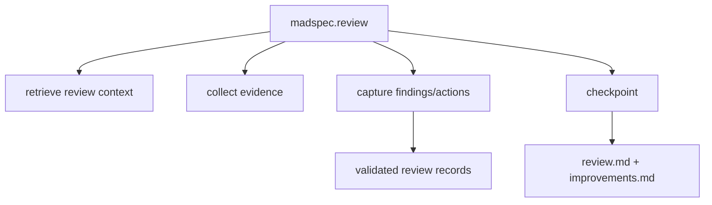
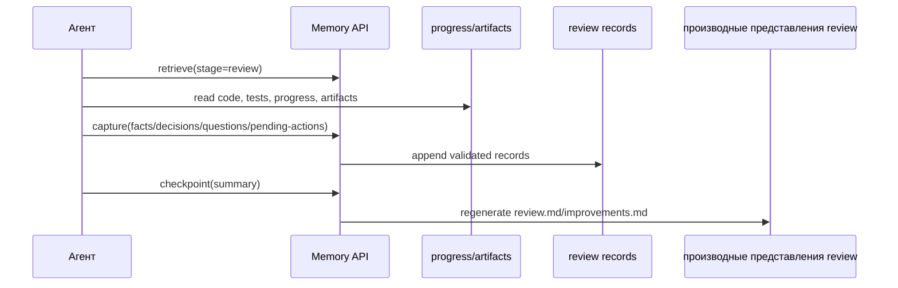
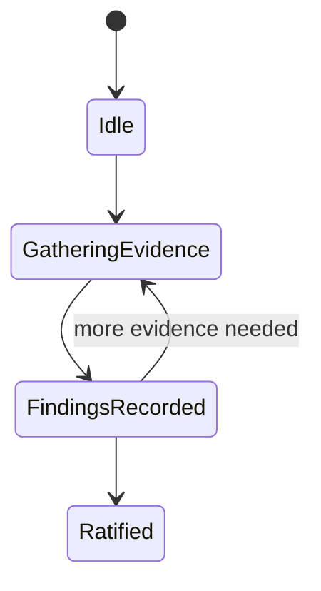
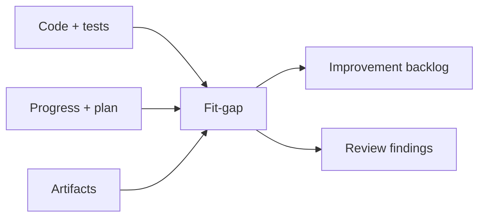

# `madspec.review`

## Назначение команды

`madspec.review` выполняет проверку качества с учетом ветки: сверяет реализацию, состояние `progress` и производные представления с замыслом ветки и формирует замечания и список улучшений.

## Когда запускать

- после заметного набора изменений
- после завершения одного или нескольких шагов реализации
- перед рефакторингом или подготовкой к релизу

## Предварительные условия и обязательный контекст

- есть кодовая база или существенные изменения для анализа
- доступна текущая ветка
- отсутствие части производных артефактов не должно автоматически блокировать review
- перед началом работы агент обязан прочитать и использовать навык `madspec-cli-operator`

## Источник истины

### Каноническое состояние

- проверенные записи review в `.madspec/<BRANCH>/memory/`

### Рабочее состояние

- `progress.json`
- `working/active-session.json`
- записи стадии реализации

### Производные представления

- `.madspec/<BRANCH>/review.md`
- `.madspec/<BRANCH>/improvements.md`
- `.madspec/<BRANCH>/project-context.md`

## Входы команды

- `madspec memory retrieve --stage review --toon-output`, если этот контекст читает агент
- `madspec review status --toon-output`, если этот вывод читает агент
- `madspec policy validate --stage review --toon-output`, если этот вывод читает агент
- код, тесты и branch artifacts
- `madspec memory capture --stage review ...`
- `madspec memory checkpoint --stage review --summary ...`

Из `retrieve` агент обязан читать `policy_context.required`, `policy_context.advisory`, `policy_context.violations` и `policy_context.confirmations`, а `madspec review status` использовать как сводку блокирующих, ожидающих и предупреждающих проверок, а также активных исключений. Если этот вывод читает агент, используй `--toon-output`.

## Пошаговый процесс выполнения

1. Агент читает контекст `review` из памяти.
2. Агент запускает `madspec review status --toon-output` и фиксирует блокирующие, ожидающие и предупреждающие проверки, активные исключения и статус ратификации.
3. Агент запускает `madspec policy validate --stage review --toon-output` и подмешивает violations, advisories и confirmations в review evidence.
4. Определяет актуальный процесс реализации: `mvp.implement` или `feature.implement`.
5. Загружает `progress`, план реализации, контексты шагов и артефакты ветки.
6. Проводит анализ расхождений, проверку кода и тестов, проверку архитектуры и интеграций, а также разбор списка улучшений.
7. Сохраняет findings, decisions, questions и pending actions через `capture`, включая наблюдения по контрольным проверкам и правилам проекта.
8. `checkpoint` пересобирает `review.md` и `improvements.md`.

## Каноническая модель данных

Review не использует отдельный JSON стадии. Источник истины — проверенные записи:

- `facts` для замечаний и ограничений
- `decisions` для принятых направлений исправления
- `questions` для открытых вопросов
- `pendingActions` для списка улучшений

Checkpoint требует:

- `summary`
- либо новые проверенные записи, либо уже накопленная память стадии

## Производные артефакты

- `review.md`
- `improvements.md`
- `project-context.md`

Представление `review.md` также показывает производную секцию `gate summary` и список активных исключений.

## Диаграммы

## Типовые ошибки, расхождения и ограничения

- review блокируется только потому, что отсутствует часть производных артефактов
- замечания остаются в чате и не фиксируются в памяти
- backlog улучшений не разделен по приоритету

## Соседние команды и передача дальше

- источник изменений: [`mvp.implement`](../mvp/madspec.mvp.implement.md) или [`feature.implement`](../feature/madspec.feature.implement.md)
- соседняя quality-команда: [`madspec.security`](./madspec.security.md)

## Что не является источником истины

- `.madspec/<BRANCH>/review.md`
- `.madspec/<BRANCH>/improvements.md`
- устный review-отчет без проверенных записей
