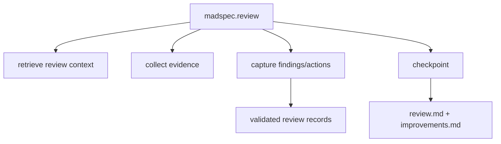
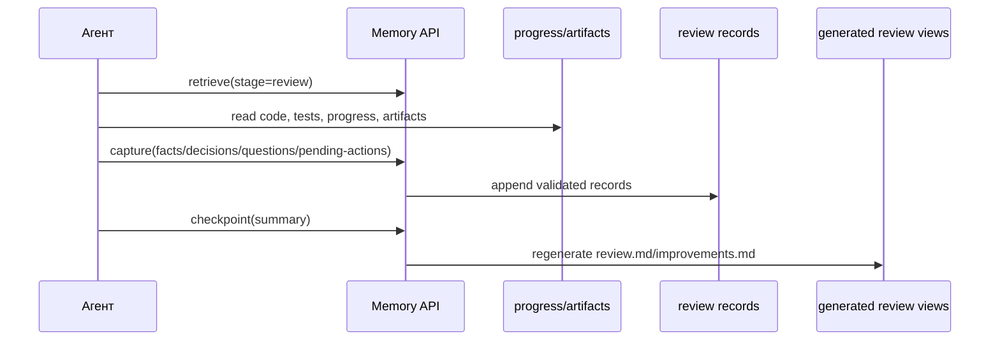
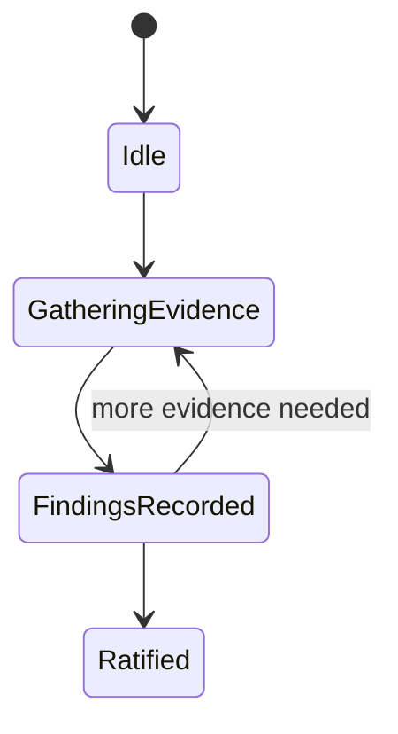
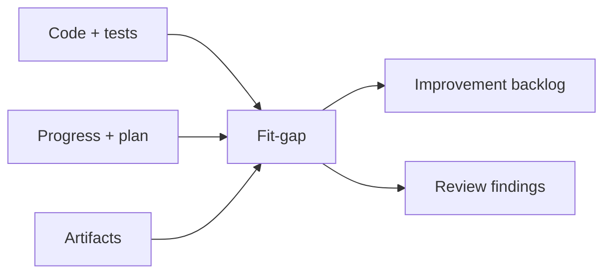

# `madspec.review`

## Назначение команды

`madspec.review` выполняет branch-aware review качества: сверяет реализацию, progress state и generated views с intent ветки и формирует findings и improvement backlog.

## Когда запускать

- после заметного change set
- после завершения одного или нескольких implementation steps
- перед рефакторингом или подготовкой к релизу

## Preconditions / required context

- есть codebase или существенные изменения для анализа
- доступна текущая ветка
- отсутствие части generated artifacts не должно автоматически блокировать review
- перед началом работы агент обязан прочитать и использовать skill `madspec-cli-operator`

## Источник истины

### Canonical state

- validated review records в `.madspec/<BRANCH>/memory/`

### Runtime / working state

- `progress.json`
- `working/active-session.json`
- implementation stage records

### Generated views

- `.madspec/<BRANCH>/review.md`
- `.madspec/<BRANCH>/improvements.md`
- `.madspec/<BRANCH>/project-context.md`

## Входы команды

- `madspec memory retrieve --stage review --json-output`
- код, тесты и branch artifacts
- `madspec memory capture --stage review ...`
- `madspec memory checkpoint --stage review --summary ...`

## Пошаговый runtime workflow

1. Агент читает `review` memory context.
2. Определяет актуальный implementation workflow: `mvp.implement` или `feature.implement`.
3. Загружает progress, implementation plan, step contexts и branch artifacts.
4. Проводит fit-gap review, code/test review, architecture/integration review и improvement triage.
5. Сохраняет findings, decisions, questions и pending actions через `capture`.
6. `checkpoint` пересобирает `review.md` и `improvements.md`.

## Canonical data model

Review не использует отдельный stage JSON. Источник истины — validated records:

- `facts` для findings и limitations
- `decisions` для accepted remediation directions
- `questions` для open issues
- `pendingActions` для improvement backlog

Checkpoint требует:

- `summary`
- либо новые validated records, либо уже накопленный stage memory

## Generated artifacts

- `review.md`
- `improvements.md`
- `project-context.md`

## Диаграммы

## Типовые ошибки / drift / ограничения

- review блокируется только потому, что отсутствует часть generated artifacts
- findings остаются в чате и не фиксируются в memory
- backlog улучшений не разделен по приоритету

## Соседние команды и handoff

- источник изменений: [`mvp.implement`](../mvp/madspec.mvp.implement.md) или [`feature.implement`](../feature/madspec.feature.implement.md)
- соседняя quality-команда: [`madspec.security`](./madspec.security.md)

## Что не является источником истины

- `.madspec/<BRANCH>/review.md`
- `.madspec/<BRANCH>/improvements.md`
- устный review-отчет без validated records
