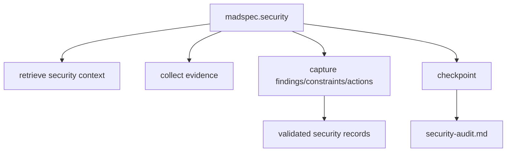
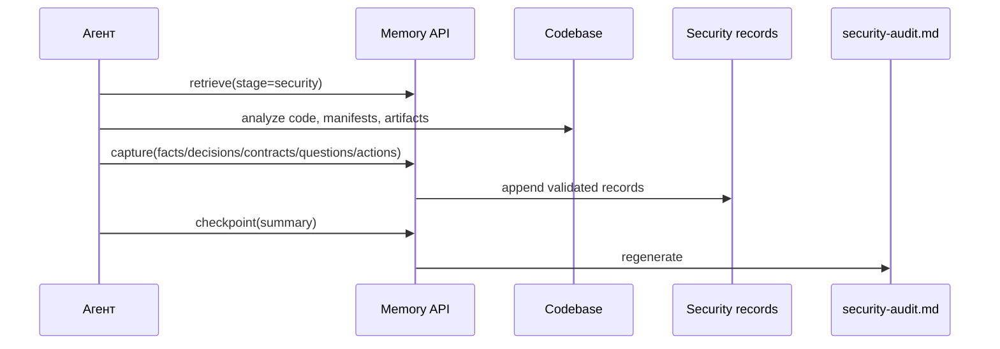
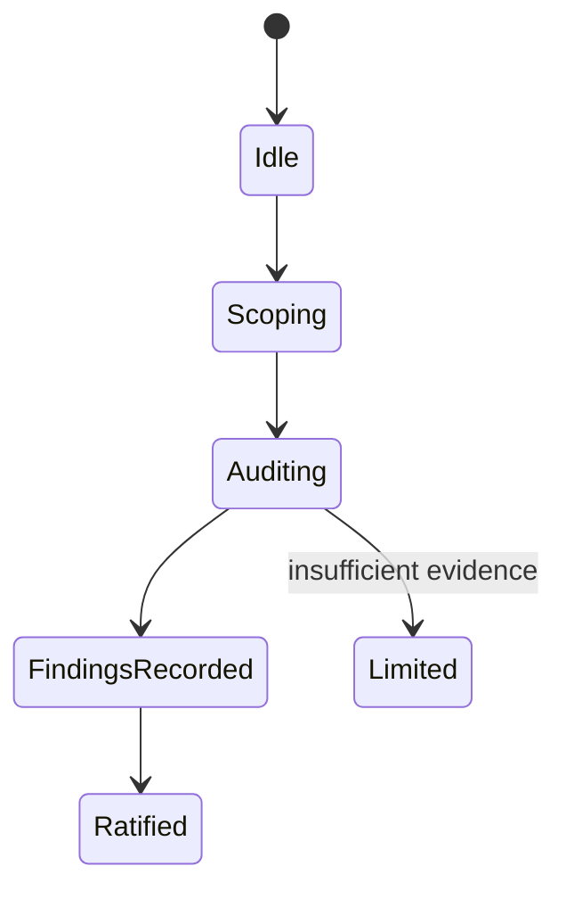
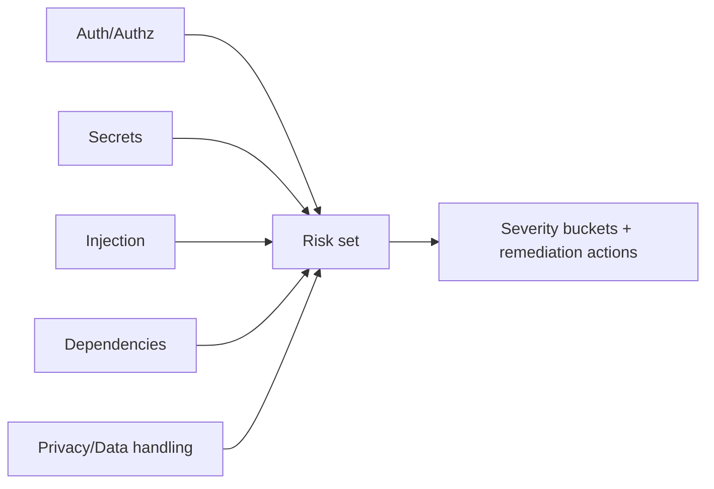

# `madspec.security`

## Назначение команды

`madspec.security` выполняет практический аудит безопасности и приватности по текущему набору изменений, кодовой базе и контексту ветки с учетом рисков `authn/authz`, `secrets`, `input validation`, `dependencies`, `data handling` и пробелов в приватности.

## Когда запускать

- после появления рабочего кода
- перед релизом или усилением защиты
- после крупных интеграционных или архитектурных изменений

## Предварительные условия и обязательный контекст

- есть код или заметный набор изменений
- контекст ветки доступен
- отсутствие части артефактов фиксируется как ограничение, а не как жесткая блокировка
- перед началом работы агент обязан прочитать и использовать навык `madspec-cli-operator`

## Источник истины

### Каноническое состояние

- проверенные записи безопасности в `.madspec/<BRANCH>/memory/`

### Рабочее состояние

- прогресс реализации
- память стадии из `mvp.implement` или `feature.implement`

### Производные представления

- `.madspec/<BRANCH>/security-audit.md`
- `.madspec/<BRANCH>/project-context.md`
- `.madspec/<BRANCH>/deployment.md` как официальный производный артефакт этапа `deploy`, если он существует

## Входы команды

- `madspec memory retrieve --stage security --toon-output`, если этот контекст читает агент
- `madspec security status --toon-output`, если этот вывод читает агент
- при наличии процесса реализации: `madspec memory retrieve --stage mvp.implement|feature.implement --toon-output`, если этот контекст читает агент
- код, манифесты, тесты, архитектурные артефакты
- `madspec memory capture --stage security ...`
- `madspec memory checkpoint --stage security --summary ...`

Поддерживаемые режимы охвата из шаблона команды:

- `default`
- `release`
- `privacy`
- `deep`

## Пошаговый процесс выполнения

1. Агент читает контекст `security` и состояние реализации.
2. Агент запускает `madspec security status --toon-output` и фиксирует блокирующие, ожидающие и предупреждающие проверки, активные исключения и статус ратификации.
3. Определяет ограничения анализа: код, манифесты, план развертывания, тесты.
4. Выполняет аудит по категориям: `authn/authz`, `secrets`, `injection`, `dependencies`, `storage/transport/logging`, `external integrations`.
5. Отдельно проверяет пробелы в `privacy/data handling`.
6. Сохраняет замечания, решения по исправлению, ограничения и отложенные действия через `capture`.
7. `checkpoint` пересобирает `security-audit.md`.

## Каноническая модель данных

Отдельного `security.json` нет. Источник истины — stage records:

- `facts` для рисков и ограничений
- `decisions` для направлений исправления и компенсирующих мер
- `contracts` для ограничений по безопасности и приватности
- `questions` для неразрешенных вопросов
- `pendingActions` для списка исправлений

Классификация риска в выводе:

- `critical`
- `high`
- `medium`
- `low`

## Производные артефакты

- `security-audit.md`
- `project-context.md`

Представление `security-audit.md` также показывает производную секцию `gate summary` и список активных исключений.

## Диаграммы

## Типовые ошибки, расхождения и ограничения

- отсутствие контекста развертывания трактуется как доказанный сбой безопасности, а не как ограничение
- результаты сканирования зависимостей выдумываются без фактического запуска инструментов
- `security-audit.md` редактируется вручную

## Соседние команды и передача дальше

- источники изменений: [`mvp.implement`](../mvp/madspec.mvp.implement.md) или [`feature.implement`](../feature/madspec.feature.implement.md)
- соседняя quality-команда: [`madspec.review`](./madspec.review.md)

## Что не является источником истины

- `.madspec/<BRANCH>/security-audit.md`
- числовая оценка безопасности, если она не поддержана отдельной моделью
- устные выводы без проверенных записей
