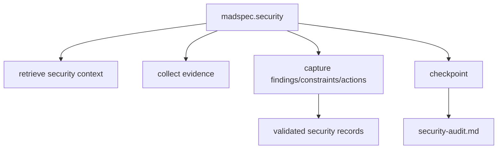
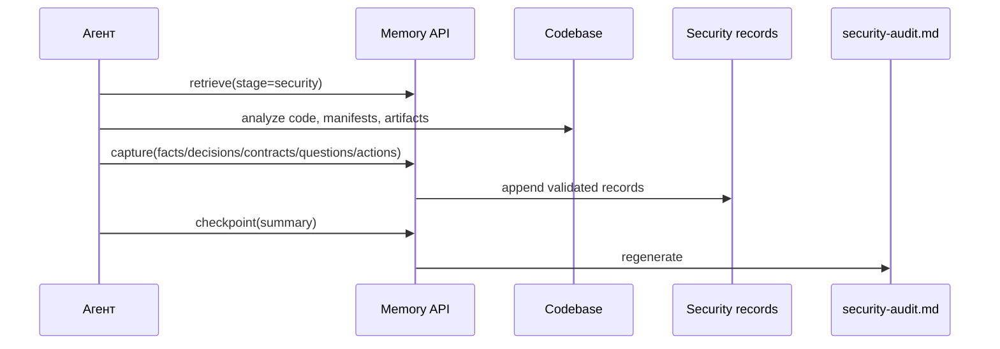
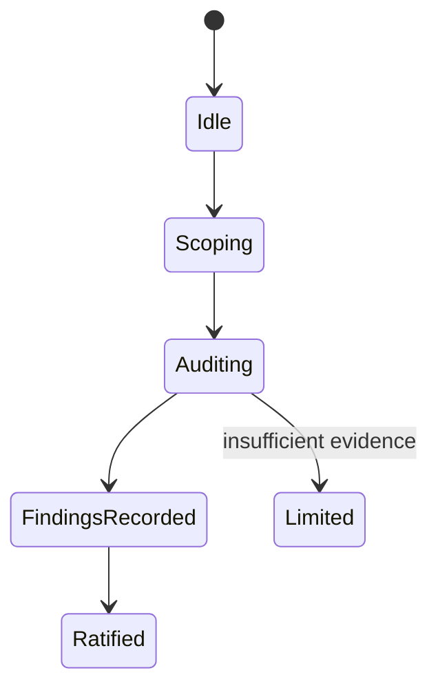
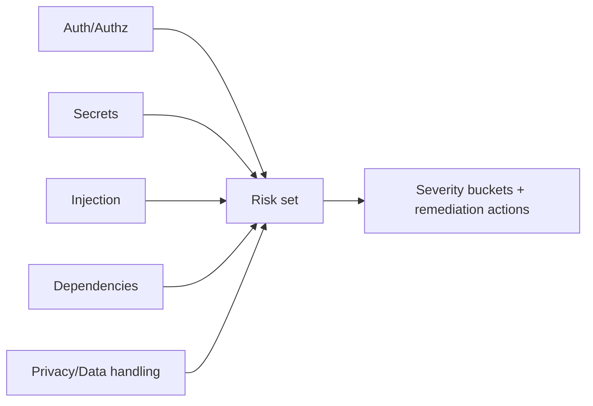

# `madspec.security`

## Назначение команды

`madspec.security` выполняет pragmatic security/privacy audit по текущему change set, codebase и branch context с учетом рисков authn/authz, secrets, input validation, dependencies, data handling и privacy gaps.

## Когда запускать

- после появления рабочего кода
- перед релизом или hardening
- после крупных интеграционных или архитектурных изменений

## Preconditions / required context

- есть код или заметный change set
- branch context доступен
- отсутствие части артефактов фиксируется как limitation, а не как hard blocker
- перед началом работы агент обязан прочитать и использовать skill `madspec-cli-operator`

## Источник истины

### Canonical state

- validated security records в `.madspec/<BRANCH>/memory/`

### Runtime / working state

- implementation progress
- stage memory из `mvp.implement` или `feature.implement`

### Generated views

- `.madspec/<BRANCH>/security-audit.md`
- `.madspec/<BRANCH>/project-context.md`

## Входы команды

- `madspec memory retrieve --stage security --json-output`
- при наличии implementation workflow: `madspec memory retrieve --stage mvp.implement|feature.implement --json-output`
- код, manifests, tests, architecture artifacts
- `madspec memory capture --stage security ...`
- `madspec memory checkpoint --stage security --summary ...`

Поддерживаемые scope режимы из шаблона команды:

- `default`
- `release`
- `privacy`
- `deep`

## Пошаговый runtime workflow

1. Агент читает security context и implementation state.
2. Определяет ограничения анализа: код, manifests, deployment context, tests.
3. Выполняет audit по категориям: authn/authz, secrets, injection, dependencies, storage/transport/logging, external integrations.
4. Отдельно проверяет privacy/data handling gaps.
5. Сохраняет findings, remediation decisions, constraints и pending actions через `capture`.
6. `checkpoint` пересобирает `security-audit.md`.

## Canonical data model

Отдельного `security.json` нет. Источник истины — stage records:

- `facts` для risks и limitations
- `decisions` для remediation directions и compensating controls
- `contracts` для security/privacy constraints
- `questions` для unresolved unknowns
- `pendingActions` для remediation backlog

Risk classification в output:

- `critical`
- `high`
- `medium`
- `low`

## Generated artifacts

- `security-audit.md`
- `project-context.md`

## Диаграммы

## Типовые ошибки / drift / ограничения

- отсутствующий deployment context трактуется как доказанный security failure, а не как limitation
- results сканирования зависимостей выдумываются без фактического запуска tools
- `security-audit.md` редактируется вручную

## Соседние команды и handoff

- источники изменений: [`mvp.implement`](../mvp/madspec.mvp.implement.md) или [`feature.implement`](../feature/madspec.feature.implement.md)
- соседняя quality-команда: [`madspec.review`](./madspec.review.md)

## Что не является источником истины

- `.madspec/<BRANCH>/security-audit.md`
- числовой security score, если он не поддержан отдельной моделью
- устные выводы без validated records
